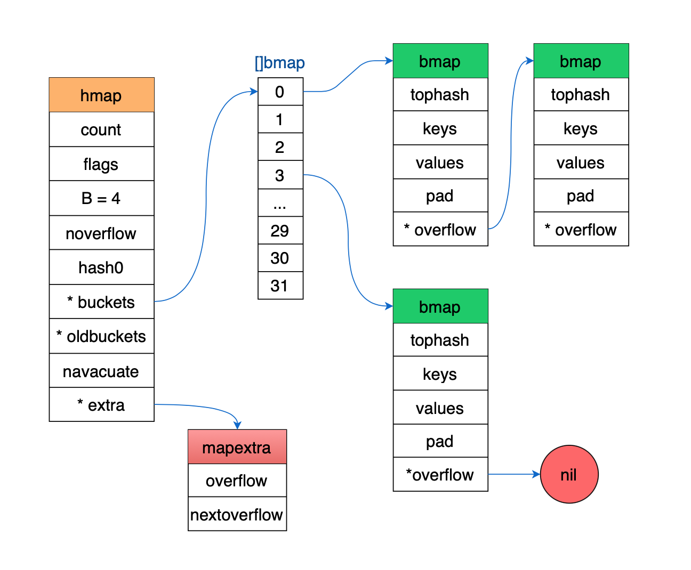

1. [map 的底层如何实现](#map-的底层如何实现)


**map 的底层实现原理是什么**

map 是由 key-value 对组成的；key 只会出现一次。

map 的设计也被称为 “The dictionary problem”，它的任务是设计一种数据结构用来维护一个集合的数据，并且可以同时对集合进行增删查改的操作。
最主要的数据结构有两种：**哈希查找表（Hash table）、搜索树（Search tree）**。

**哈希查找表**用一个哈希函数将 key 分配到不同的桶（bucket，也就是数组的不同 index）。这样，开销主要在哈希函数的计算以及数组的常数访问时间。在很多场景下，哈希查找表的性能很高。

哈希查找表一般会存在“碰撞”的问题，就是说不同的 key 被哈希到了同一个 bucket。一般有两种应对方法：**链表法和开放地址法**。链表法将一个 bucket 实现成一个链表，落在同一个 bucket 中的 key 都会插入这个链表。开放地址法则是碰撞发生后，通过一定的规律，在数组的后面挑选“空位”，用来放置新的 key。

搜索树法一般采用自平衡搜索树，包括：AVL 树，红黑树。面试时经常会被问到，甚至被要求手写红黑树代码。

自平衡搜索树法的最差搜索效率是 O(logN)，而哈希查找表最差是 O(N)。当然，哈希查找表的平均查找效率是 O(1)，如果哈希函数设计的很好，最坏的情况基本不会出现。还有一点，遍历自平衡搜索树，返回的 key 序列，一般会按照从小到大的顺序；而哈希查找表则是乱序的。


**为什么要用 map**

从 Go 语言官方博客摘录一段话：

"One of the most useful data structures in computer science is the hash table. Many hash table implementations exist with varying properties, but in general they offer fast lookups, adds, and deletes. Go provides a built-in map type that implements a hash table."

hash table 是计算机数据结构中一个最重要的设计。大部分 hash table 都实现了快速查找、添加、删除的功能。Go 语言内置的 map 实现了上述所有功能。

**因为它太强大了，各种增删查改的操作效率非常高。**


## map 的底层如何实现


**Go 语言 map 采用的是哈希查找表，并且使用链表解决哈希冲突。**

代码基于 
go version go1.17 darwin/amd64


Go 的 map 实现在 src/runtime/map.go 这个文件中。

map 底层实质还是一个 hash table。

先来看看 Go 定义了一些常量。

```go

const (
	// 一个桶 bucket 里面最多可以装的键值对的个数，8对
	bucketCntBits = 3
	bucketCnt     = 1 << bucketCntBits	// 1<<3 == 2^3 == 8

	// 触发扩容操作的最大装载因子的临界值是 6.5
	// Represent as loadFactorNum/loadFactorDen, to allow integer math.
	loadFactorNum = 13	
	loadFactorDen = 2
	
	// 为了保持内联，键 和 值 的最大长度都是128字节，如果超过了128个字节，就存储它的指针
	maxKeySize  = 128
	maxElemSize = 128

	// 数据偏移应该是 bmap 的整数倍，但是需要正确的对齐。
	dataOffset = unsafe.Offsetof(struct {
		b bmap
		v int64
	}{}.v)

	// tophash 的一些值
	emptyRest      = 0 // cell 是空的（没有键值对），并且在更高的索引或溢出处不再有非空 cell 单元格.
	emptyOne       = 1 // cell 是空的
	evacuatedX     = 2 // 键值对有效，并且已经迁移了一个表的前半段
	evacuatedY     = 3 // 键值对有效，并且已经迁移了一个表的后半段
	evacuatedEmpty = 4 // cell是空的，并且桶内的键值被迁移走了
	minTopHash     = 5 // 最小的 tophash 

	// flags 标记
	iterator     = 1 // 当前桶的迭代子
	oldIterator  = 2 // 旧桶的迭代子
	hashWriting  = 4 // 一个goroutine正在写入map
	sameSizeGrow = 8 // 当前 map 增长到新 map 相同尺寸

	// 迭代子检查桶ID的哨兵
	noCheck = 1<<(8*sys.PtrSize) - 1 
)
```


这里值得说明的一点是触发扩容操作的临界值6.5是怎么得来的。这个值太大会导致overflow buckets过多，查找效率降低，过小会浪费存储空间。

据 Google 开发人员称，这个值是一个测试的程序，测量出来选择的一个经验值。

**loadFactor = loadFactorNum / loadFactorDen = 13 / 2 = 6.5**

```go
loadFactor := count / (2^B)
```

loadFactorNum：map 的元素个数 count；

loadFactorDen：2^B 表示 bucket 数量。


```go
// Picking loadFactor: too large and we have lots of overflow
// buckets, too small and we waste a lot of space. I wrote
// a simple program to check some stats for different loads:
// (64-bit, 8 byte keys and elems)
//  loadFactor    %overflow  bytes/entry     hitprobe    missprobe
//        4.00         2.13        20.77         3.00         4.00
//        4.50         4.05        17.30         3.25         4.50
//        5.00         6.85        14.77         3.50         5.00
//        5.50        10.55        12.94         3.75         5.50
//        6.00        15.27        11.67         4.00         6.00
          6.50        20.90        10.79         4.25         6.50
//        7.00        27.14        10.15         4.50         7.00
//        7.50        34.03         9.73         4.75         7.50
//        8.00        41.10         9.40         5.00         8.00
```

%overflow ：
溢出率，平均一个 bucket 有多少个 键值kv 的时候会溢出。

bytes/entry ：
平均存一个 键值kv 需要额外存储多少字节的数据。

hitprobe ：
查找一个存在的 key 平均查找次数。

missprobe ：
查找一个不存在的 key 平均查找次数。


**经过这几组测试数据，最终选定 6.5 作为临界的装载因子。**

渐进式扩容：键值对迁移的时间分摊到多次哈希表操作中的方式，可避免一次性扩容带来的性能瞬时抖动


**Go 中 map header 的定义：**

```go
// A header for a Go map.
type hmap struct {
	
	count     int 	 // 键值对数目
	flags     uint8
	B         uint8  // 总共能存 6.5 * 2^B 个元素
	noverflow uint16 
	hash0     uint32 

	buckets    unsafe.Pointer // 桶
	oldbuckets unsafe.Pointer // 旧桶
	nevacuate  uintptr        // 下一次待迁移的桶的编号

	extra *mapextra 
}
```


```go
// A header for a Go map.
type hmap struct {
	
	count     int 	 // map 的长度 (键值对数目)
	flags     uint8
	// B 是 buckets 数组的长度的对数，也就是说 buckets 数组的长度就是 2^B
	B         uint8  // log以2为底，桶个数的对数 (总共能存 6.5 * 2^B 个元素)
	noverflow uint16 // 近似溢出桶的个数
	hash0     uint32 // 哈希种子

	buckets    unsafe.Pointer // 指向 buckets 数组，大小为 2^B, 如果元素个数为0，就为 nil
	oldbuckets unsafe.Pointer // 扩容的时候，buckets 长度会是 oldbuckets 的两倍
	nevacuate  uintptr        // 扩容增长过程中的计数器(下一次待迁移的桶的编号)

	extra *mapextra // 可选字段
}
```


```go
// mapextra holds fields that are not present on all maps.
type mapextra struct {
	// If both key and elem do not contain pointers and are inline, then we mark bucket
	// type as containing no pointers. This avoids scanning such maps.
	// However, bmap.overflow is a pointer. In order to keep overflow buckets
	// alive, we store pointers to all overflow buckets in hmap.extra.overflow and hmap.extra.oldoverflow.
	// overflow and oldoverflow are only used if key and elem do not contain pointers.
	
	// overflow contains overflow buckets for hmap.buckets.
	// oldoverflow contains overflow buckets for hmap.oldbuckets.
	// The indirection allows to store a pointer to the slice in hiter.
	overflow    *[]*bmap
	oldoverflow *[]*bmap

	// nextOverflow holds a pointer to a free overflow bucket.
	nextOverflow *bmap
}
```


buckets 是一个指针，最终它指向的是一个结构体：
```go
// A bucket for a Go map.
type bmap struct {
	tophash [bucketCnt]uint8
}
```

但这只是表面(src/runtime/map.go)的结构，编译期间会给它加料，动态地创建一个新的结构：
```go
type bmap struct {
    topbits  [8]uint8
    keys     [8]keytype
    values   [8]valuetype
    pad      uintptr
    overflow uintptr
}
```


bmap 就是我们常说的“桶”，桶里面会最多装 8 个 key，这些 key 之所以会落入同一个桶，是因为它们经过哈希计算后，哈希结果是“一类”的。在桶内，又会根据 key 计算出来的 hash 值的高 8 位来决定 key 到底落入桶内的哪个位置（一个桶内最多有8个位置）。

来一个整体的图：




