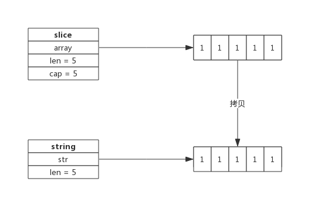

1. [字符怎么存?](#字符怎么存)
2. [String 标准概念](#string-标准概念)
3. [为什么字符串不允许修改？](#为什么字符串不允许修改)
4. [[]byte转string](#byte转string)
5. [字符串拼接](#字符串拼接)
6. [[]byte转换成string一定会拷贝内存吗？](#byte转换成string一定会拷贝内存吗)
7. [string和[]byte如何取舍](#string和byte如何取舍)


## 字符怎么存?  

字符集配合 UTF-8 编码


## String 标准概念


Go标准库builtin给出了所有内置类型的定义。 源代码位于src/builtin/builtin.go，其中关于string的描述如下:

```go
// string is the set of all strings of 8-bit bytes, conventionally but not
// necessarily representing UTF-8-encoded text. A string may be empty, but
// not nil. Values of string type are immutable.
type string string
```

所以string是8比特字节的集合，通常但并不一定是UTF-8编码的文本。

另外，还提到了两点，非常重要：

- string可以为空（长度为0），但不会是nil；
- string对象不可以修改。


**string 数据结构**

源码包src/runtime/string.go:stringStruct定义了string的数据结构：

```go
type stringStruct struct {
	str unsafe.Pointer
	len int
}
```
其数据结构很简单：
- stringStruct.str：字符串的首地址；
- stringStruct.len：字符串的长度；

string 数据结构跟切片有些类似，只不过切片还有一个表示容量的成员，事实上string和切片，准确的说是byte切片经常发生转换。这个后面再详细介绍。


**string操作**

**声明**

如下代码所示，可以声明一个string变量变赋予初值：


## 为什么字符串不允许修改？

- 像C++语言中的string，其本身拥有内存空间，修改string是支持的。
- 但Go的实现中，string不包含内存空间，只有一个内存的指针，这样做的好处是string变得非常轻量，可以很方便的进行传递而不用担心内存拷贝。

**因为string通常指向字符串字面量，而字符串字面量存储位置是只读段，而不是堆或栈上，所以才有了string不可修改的约定。**


如果是代码中存在的字符串，编译器会将其标记成只读数据 SRODATA，假设我们有以下代码，其中包含了一个字符串，当我们将这段代码编译成汇编语言时，就能够看到 hello 字符串有一个 SRODATA 的标记：

```go
package main

func main() {
	str := "hello"
	println([]byte(str))
}

➜  GOOS=linux GOARCH=amd64 go tool compile -S main.go
go.string."hello" SRODATA dupok size=5
        0x0000 68 65 6c 6c 6f                                   hello

```


只读只意味着字符串会分配到只读的内存空间，但是 Go 语言只是不支持直接修改 string 类型变量的内存空间，我们仍然可以通过在 string 和 []byte 类型之间反复转换实现修改这一目的：

1. 先将这段内存拷贝到堆或者栈上；
2. 将变量的类型转换成 []byte 后并修改字节数据；
3. 将修改后的字节数组转换回 string；

Java、Python 以及很多编程语言的字符串也都是不可变的，这种不可变的特性可以保证我们不会引用到意外发生改变的值，而因为 Go 语言的字符串可以作为哈希的键，所以如果哈希的键是可变的，不仅会增加哈希实现的复杂度，还可能会影响哈希的比较。


## []byte转string

```go
// slicebytetostring converts a byte slice to a string.
// It is inserted by the compiler into generated code.
// ptr is a pointer to the first element of the slice;
// n is the length of the slice.
// Buf is a fixed-size buffer for the result,
// it is not nil if the result does not escape.
func slicebytetostring(buf *tmpBuf, ptr *byte, n int) (str string) {
	if n == 0 {
		// Turns out to be a relatively common case.
		// Consider that you want to parse out data between parens in "foo()bar",
		// you find the indices and convert the subslice to string.
		return ""
	}
	if raceenabled {
		racereadrangepc(unsafe.Pointer(ptr),
			uintptr(n),
			getcallerpc(),
			abi.FuncPCABIInternal(slicebytetostring))
	}
	if msanenabled {
		msanread(unsafe.Pointer(ptr), uintptr(n))
	}
	if asanenabled {
		asanread(unsafe.Pointer(ptr), uintptr(n))
	}
	if n == 1 {
		p := unsafe.Pointer(&staticuint64s[*ptr])
		if goarch.BigEndian {
			p = add(p, 7)
		}
		stringStructOf(&str).str = p
		stringStructOf(&str).len = 1
		return
	}

	var p unsafe.Pointer
	if buf != nil && n <= len(buf) {
		p = unsafe.Pointer(buf)
	} else {
		p = mallocgc(uintptr(n), nil, false) // 1. 根据切片的长度申请内存空间
	}
	stringStructOf(&str).str = p // 2. 构建string
	stringStructOf(&str).len = n 
	memmove(p, unsafe.Pointer(ptr), uintptr(n)) // 3. 内存拷贝
	return
}
```

需要注意的是这种转换需要一次内存拷贝。

转换过程如下：

1. 根据切片的长度申请内存空间，假设内存地址为p，切片长度为len(b)；
2. 构建string（string.str = p；string.len = len；）
3. 拷贝数据(切片中数据拷贝到新申请的内存空间)

byte切片可以很方便的转换成string，如下所示：

转换示意图：




## 字符串拼接

字符串可以很方便的拼接，像下面这样：
```go
str := "Str1" + "Str2" + "Str3"
```

即便有非常多的字符串需要拼接，性能上也有比较好的保证，因为新字符串的内存空间是一次分配完成的，所以性能消耗主要在拷贝数据上。

一个拼接语句的字符串编译时都会被存放到一个切片中，拼接过程需要遍历两次切片，第一次遍历获取总的字符串长度，据此申请内存，第二次遍历会把字符串逐个拷贝过去。

```go
// concatstrings implements a Go string concatenation x+y+z+...
// The operands are passed in the slice a.
// If buf != nil, the compiler has determined that the result does not
// escape the calling function, so the string data can be stored in buf
// if small enough.
func concatstrings(buf *tmpBuf, a []string) string {
	idx := 0
	l := 0 
	count := 0
	for i, x := range a { // 第一次遍历获取总的字符串长度，据此申请内存
		n := len(x)
		if n == 0 {
			continue
		}
		if l+n < l {
			throw("string concatenation too long")
		}
		l += n
		count++
		idx = i
	}
	if count == 0 {
		return ""
	}

	// If there is just one string and either it is not on the stack
	// or our result does not escape the calling frame (buf != nil),
	// then we can return that string directly.
	if count == 1 && (buf != nil || !stringDataOnStack(a[idx])) {
		return a[idx]
	}
	s, b := rawstringtmp(buf, l)  // 生成指定大小的字符串，返回一个string和切片，二者共享内存空间
	for _, x := range a { // 第二次遍历会把字符串逐个拷贝过去。
		copy(b, x)
		b = b[len(x):]
	}
	return s
}
```
因为string是无法直接修改的，所以这里使用rawstring()方法初始化一个指定大小的string，同时返回一个切片，二者共享同一块内存空间，后面向切片中拷贝数据，也就间接修改了string。

rawstringtmp()源代码如下：
```go
// 生成一个新的string，返回的string和切片共享相同的空间
func rawstringtmp(buf *tmpBuf, l int) (s string, b []byte) { 
	if buf != nil && l <= len(buf) {
		b = buf[:l]
		s = slicebytetostringtmp(&b[0], len(b))
	} else {
		s, b = rawstring(l)
	}
	return
}
```


## []byte转换成string一定会拷贝内存吗？

byte切片转换成string的场景很多，为了性能上的考虑，有时候只是临时需要字符串的场景下，byte切片转换成string时并不会拷贝内存，
而是直接返回一个string，这个string的指针(string.str)指向切片的内存。

比如，编译器会识别如下临时场景：

- 使用m[string(b)]来查找map（map是string为key，临时把切片b转成string）；
- 字符串拼接，如"<" + "string(b)" + ">"；
- 字符串比较：string(b) == "foo"
因为是临时把byte切片转换成string，也就避免了因byte切片同容改成而导致string引用失败的情况，所以此时可以不必拷贝内存新建一个string。


## string和[]byte如何取舍

string和[]byte都可以表示字符串，但因数据结构不同，其衍生出来的方法也不同，要跟据实际应用场景来选择。

**string 擅长的场景：**

- 需要字符串比较的场景；
- 不需要nil字符串的场景；

**[]byte擅长的场景：**

- 修改字符串的场景，尤其是修改粒度为1个字节；
- 函数返回值，需要用nil表示含义的场景；
- 需要切片操作的场景；

虽然看起来string适用的场景不如[]byte多，但**因为string直观，在实际应用中还是大量存在，在偏底层的实现中[]byte使用更多。**


参考：

[Go专家编程](https://books.studygolang.com/GoExpertProgramming/chapter01/1.6-string.html)


   
