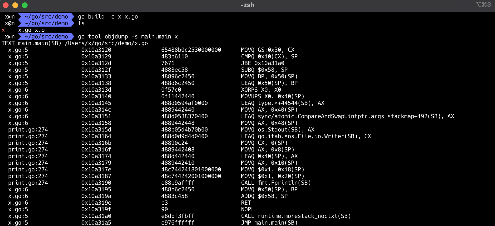
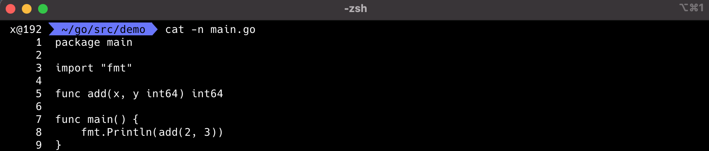

# Go ASM (Go Assembler - Go 汇编)


## X86-64体系结构
X86其实是是80X86的简称（后面三个字母），包括Intel 8086、80286、80386以及80486等指令集合，因此其架构被称为x86架构。x86-64是AMD公司于1999年设计的x86架构的64位拓展，向后兼容于16位及32位的x86架构。X86-64目前正式名称为AMD64，也就是Go语言中GOARCH环境变量指定的AMD64。如果没有特殊说明的话，本章中的汇编程序都是针对64位的X86-64环境。

在使用汇编语言之前必须要了解对应的CPU体系结构。下面是X86/AMD架构图：


左边是内存部分是常见的内存布局。其中text一般对应代码段，用于存储要执行指令数据，代码段一般是只读的。然后是rodata和data数据段，数据段一般用于存放全局的数据，其中rodata是只读的数据段。而heap段则用于管理动态的数据，stack段用于管理每个函数调用时相关的数据。在汇编语言中一般重点关注text代码段和data数据段，因此Go汇编语言中专门提供了对应TEXT和DATA命令用于定义代码和数据。

中间是X86提供的寄存器。寄存器是CPU中最重要的资源，每个要处理的内存数据原则上需要先放到寄存器中才能由CPU处理，同时寄存器中处理完的结果需要再存入内存。X86中除了状态寄存器FLAGS和指令寄存器IP两个特殊的寄存器外，还有AX、BX、CX、DX、SI、DI、BP、SP几个通用寄存器。在X86-64中又增加了八个以R8-R15方式命名的通用寄存器。因为历史的原因R0-R7并不是通用寄存器，它们只是X87开始引入的MMX指令专有的寄存器。在通用寄存器中BP和SP是两个比较特殊的寄存器：其中BP用于记录当前函数帧的开始位置，和函数调用相关的指令会隐式地影响BP的值；SP则对应当前栈指针的位置，和栈相关的指令会隐式地影响SP的值；而某些调试工具需要BP寄存器才能正常工作。

右边是X86的指令集。CPU是由指令和寄存器组成，指令是每个CPU内置的算法，指令处理的对象就是全部的寄存器和内存。我们可以将每个指令看作是CPU内置标准库中提供的一个个函数，然后基于这些函数构造更复杂的程序的过程就是用汇编语言编程的过程。


## Go汇编中的伪寄存器
Go汇编为了简化汇编代码的编写，引入了PC、FP、SP、SB四个伪寄存器。四个伪寄存器加其它的通用寄存器就是Go汇编语言对CPU的重新抽象，该抽象的结构也适用于其它非X86类型的体系结构。

四个伪寄存器和X86/AMD64的内存和寄存器的相互关系如下图：


在AMD64环境，伪PC寄存器其实是IP指令计数器寄存器的别名。伪FP寄存器对应的是函数的帧指针，一般用来访问函数的参数和返回值。伪SP栈指针对应的是当前函数栈帧的底部（不包括参数和返回值部分），一般用于定位局部变量。伪SP是一个比较特殊的寄存器，因为还存在一个同名的SP真寄存器。真SP寄存器对应的是栈的顶部，一般用于定位调用其它函数的参数和返回值。

当需要区分伪寄存器和真寄存器的时候只需要记住一点：伪寄存器一般需要一个标识符和偏移量为前缀，如果没有标识符前缀则是真寄存器。比如(SP)、+8(SP)没有标识符前缀为真SP寄存器，而a(SP)、b+8(SP)有标识符为前缀表示伪寄存器。


## plan9 汇编


## 高级语言函数

函数栈：

```go
                         +--------------+
                         |              |
                    +    |              |
                    |    +--------------+
                    |    |              |
                    |    |   arg(N-1)   |  starts from 7'th argument for x86_64
                    |    |              |
                    |    +--------------+
                    |    |              |
                    |    |     argN     |
                    |    |              |
                    |    +--------------+
                    |    |              |
                    |    |Return address|  %rbp + 8
Stack grows down    |    |              |
                    |    +--------------+
                    |    |              |
                    |    |     %rbp     |  Frame base pointer
                    |    |              |
                    |    +--------------+
                    |    |              |
                    |    |  local var1  |  %rbp - 8
                    |    |              |
                    |    +--------------+
                    |    |              |
                    |    | local var 2  | <-- %rsp
                    |    |              |
                    v    +--------------+
                         |              |
                         |              |
                         +--------------+

```

 ## Go 语言的函数调用规约

 ```go
                                                                                                                              
                                       caller                                                                                 
                                 +------------------+                                                                         
                                 |                  |                                                                         
       +---------------------->  --------------------                                                                         
       |                         |                  |                                                                         
       |                         | caller parent BP |                                                                         
       |           BP(pseudo SP) --------------------                                                                         
       |                         |                  |                                                                         
       |                         |   Local Var0     |                                                                         
       |                         --------------------                                                                         
       |                         |                  |                                                                         
       |                         |   .......        |                                                                         
       |                         --------------------                                                                         
       |                         |                  |                                                                         
       |                         |   Local VarN     |                                                                         
                                 --------------------                                                                         
 caller stack frame              |                  |                                                                         
                                 |   callee arg2    |                                                                         
       |                         |------------------|                                                                         
       |                         |                  |                                                                         
       |                         |   callee arg1    |                                                                         
       |                         |------------------|                                                                         
       |                         |                  |                                                                         
       |                         |   callee arg0    |                                                                         
       |                         ----------------------------------------------+   FP(virtual register)                       
       |                         |                  |                          |                                              
       |                         |   return addr    |  parent return address   |                                              
       +---------------------->  +------------------+---------------------------    <-------------------------------+         
                                                    |  caller BP               |                                    |         
                                                    |  (caller frame pointer)  |                                    |         
                                     BP(pseudo SP)  ----------------------------                                    |         
                                                    |                          |                                    |         
                                                    |     Local Var0           |                                    |         
                                                    ----------------------------                                    |         
                                                    |                          |                                              
                                                    |     Local Var1           |                                              
                                                    ----------------------------                            callee stack frame
                                                    |                          |                                              
                                                    |       .....              |                                              
                                                    ----------------------------                                    |         
                                                    |                          |                                    |         
                                                    |     Local VarN           |                                    |         
                                  SP(Real Register) ----------------------------                                    |         
                                                    |                          |                                    |         
                                                    |                          |                                    |         
                                                    |                          |                                    |         
                                                    |                          |                                    |         
                                                    |                          |                                    |         
                                                    +--------------------------+    <-------------------------------+         
                                                                                                                              
                                                              callee

 ```


### 程序的基本分段

```go
.data : 有初始化值的全局变量；定义常量。.bss : 没有初始化值的全局变量。
.text : 代码段。
.rodata: 只读数据段。

```

代码在 .text 段中，大概知道就行。Go 语言用户程序的入口为 main.main。


```go
$ cat x.go
package main

import "fmt"

func main() {
	fmt.Println("3")
}
$ go tool compile -S x.go  # or: go build -gcflags -S x.go
"".main STEXT size=138 args=0x0 locals=0x58 funcid=0x0
	0x0000 00000 (x.go:5)	TEXT	"".main(SB), ABIInternal, $88-0
	0x0000 00000 (x.go:5)	MOVQ	(TLS), CX
	0x0009 00009 (x.go:5)	CMPQ	SP, 16(CX)
	0x000d 00013 (x.go:5)	PCDATA	$0, $-2
	0x000d 00013 (x.go:5)	JLS	128
	0x000f 00015 (x.go:5)	PCDATA	$0, $-1
	0x000f 00015 (x.go:5)	SUBQ	$88, SP
	0x0013 00019 (x.go:5)	MOVQ	BP, 80(SP)
	0x0018 00024 (x.go:5)	LEAQ	80(SP), BP
	0x001d 00029 (x.go:5)	FUNCDATA	$0, gclocals·33cdeccccebe80329f1fdbee7f5874cb(SB)
	0x001d 00029 (x.go:5)	FUNCDATA	$1, gclocals·f207267fbf96a0178e8758c6e3e0ce28(SB)
	0x001d 00029 (x.go:5)	FUNCDATA	$2, "".main.stkobj(SB)
	0x001d 00029 (x.go:6)	XORPS	X0, X0
	0x0020 00032 (x.go:6)	MOVUPS	X0, ""..autotmp_11+64(SP)
	0x0025 00037 (x.go:6)	LEAQ	type.string(SB), AX
	0x002c 00044 (x.go:6)	MOVQ	AX, ""..autotmp_11+64(SP)
	0x0031 00049 (x.go:6)	LEAQ	""..stmp_0(SB), AX
	0x0038 00056 (x.go:6)	MOVQ	AX, ""..autotmp_11+72(SP)
	0x003d 00061 (<unknown line number>)	NOP
	0x003d 00061 ($GOROOT/src/fmt/print.go:274)	MOVQ	os.Stdout(SB), AX
	0x0044 00068 ($GOROOT/src/fmt/print.go:274)	LEAQ	go.itab.*os.File,io.Writer(SB), CX
	0x004b 00075 ($GOROOT/src/fmt/print.go:274)	MOVQ	CX, (SP)
	0x004f 00079 ($GOROOT/src/fmt/print.go:274)	MOVQ	AX, 8(SP)
	0x0054 00084 ($GOROOT/src/fmt/print.go:274)	LEAQ	""..autotmp_11+64(SP), AX
	0x0059 00089 ($GOROOT/src/fmt/print.go:274)	MOVQ	AX, 16(SP)
	0x005e 00094 ($GOROOT/src/fmt/print.go:274)	MOVQ	$1, 24(SP)
	0x0067 00103 ($GOROOT/src/fmt/print.go:274)	MOVQ	$1, 32(SP)
	0x0070 00112 ($GOROOT/src/fmt/print.go:274)	PCDATA	$1, $0
	0x0070 00112 ($GOROOT/src/fmt/print.go:274)	CALL	fmt.Fprintln(SB)
	0x0075 00117 (x.go:6)	MOVQ	80(SP), BP
	0x007a 00122 (x.go:6)	ADDQ	$88, SP
	0x007e 00126 (x.go:6)	RET
	0x007f 00127 (x.go:6)	NOP
	0x007f 00127 (x.go:5)	PCDATA	$1, $-1
	0x007f 00127 (x.go:5)	PCDATA	$0, $-2
	0x007f 00127 (x.go:5)	NOP
	0x0080 00128 (x.go:5)	CALL	runtime.morestack_noctxt(SB)
	0x0085 00133 (x.go:5)	PCDATA	$0, $-1
	0x0085 00133 (x.go:5)	JMP	0
```





```go
$ go build -o x x.go
$ go tool objdump -s main.main x
TEXT main.main(SB) /Users/x/go/src/demo/x.go
  x.go:5		0x10a3120		65488b0c2530000000	MOVQ GS:0x30, CX
  x.go:5		0x10a3129		483b6110		CMPQ 0x10(CX), SP
  x.go:5		0x10a312d		7671			JBE 0x10a31a0
  x.go:5		0x10a312f		4883ec58		SUBQ $0x58, SP
  x.go:5		0x10a3133		48896c2450		MOVQ BP, 0x50(SP)
  x.go:5		0x10a3138		488d6c2450		LEAQ 0x50(SP), BP
  x.go:6		0x10a313d		0f57c0			XORPS X0, X0
  x.go:6		0x10a3140		0f11442440		MOVUPS X0, 0x40(SP)
  x.go:6		0x10a3145		488d0594af0000		LEAQ type.*+44544(SB), AX
  x.go:6		0x10a314c		4889442440		MOVQ AX, 0x40(SP)
  x.go:6		0x10a3151		488d0538370400		LEAQ sync/atomic.CompareAndSwapUintptr.args_stackmap+192(SB), AX
  x.go:6		0x10a3158		4889442448		MOVQ AX, 0x48(SP)
  print.go:274		0x10a315d		488b05d4b70b00		MOVQ os.Stdout(SB), AX
  print.go:274		0x10a3164		488d0d9d4d0400		LEAQ go.itab.*os.File,io.Writer(SB), CX
  print.go:274		0x10a316b		48890c24		MOVQ CX, 0(SP)
  print.go:274		0x10a316f		4889442408		MOVQ AX, 0x8(SP)
  print.go:274		0x10a3174		488d442440		LEAQ 0x40(SP), AX
  print.go:274		0x10a3179		4889442410		MOVQ AX, 0x10(SP)
  print.go:274		0x10a317e		48c744241801000000	MOVQ $0x1, 0x18(SP)
  print.go:274		0x10a3187		48c744242001000000	MOVQ $0x1, 0x20(SP)
  print.go:274		0x10a3190		e88b9affff		CALL fmt.Fprintln(SB)
  x.go:6		0x10a3195		488b6c2450		MOVQ 0x50(SP), BP
  x.go:6		0x10a319a		4883c458		ADDQ $0x58, SP
  x.go:6		0x10a319e		c3			RET
  x.go:5		0x10a319f		90			NOPL
  x.go:5		0x10a31a0		e8dbf3fbff		CALL runtime.morestack_noctxt(SB)
  x.go:5		0x10a31a5		e976ffffff		JMP main.main(SB)
```


## Symbols 变量

有四个预先声明的符号指代伪寄存器。这些不是真正的寄存器，而是由工具链维护的虚拟寄存器，例如帧指针。


- SB: Static base pointer: global symbols. 指向全局变量的位置，可以把它看作是程序起始地址
- SP: Stack pointer: top of stack. 指向栈顶
- FP: Frame pointer: arguments and locals. 指向当前 Frame 的起始位置
- PC: Program counter: jumps and branches. 指向下一条要执行的指令的位置


All user-defined symbols are written as offsets to the pseudo-registers FP (arguments and locals) and SB (globals).
### 所有用户定义的变量作为伪寄存器 FP 和 SB 的偏移量写入

### 1. SB
- 因为伪寄存器 SB 可以认为是内存的起点，所以标记 foo(SB) 的名字 foo 是内存中的地址。这种形式用于命名全局函数和数据。
- 添加<>到名称中，如foo<>(SB)，使名称仅在当前源文件中可访问，就像 C 文件中的顶级 static 声明一样。
- 向名称添加偏移量是指与标记地址的偏移量，因此 foo+4(SB)是 foo相对 SB 的位置偏移 4 bytes。

### 2. FP
- FP 伪寄存器是用来指向 函数参数的虚拟帧指针。
- 编译器维护一个虚拟帧指针，并将堆栈上的参数引用为该伪寄存器的偏移量。因此0(FP)是函数的第一个参数， 8(FP)是第二个（在 64 位机器上），依此类推。但是，当以这种方式引用函数参数时，必须在开头放置一个名称，如first_arg+0(FP)和second_arg+8(FP)。（偏移量的含义——从帧指针的偏移量——不同与于 SB，它是 SB 的偏移量。）汇编器强制执行这个约定，拒绝普通0(FP)和8(FP)。实际名称在语义上无关，但应用于记录参数的名称。值得强调的是FP 始终是伪寄存器，而不是硬件寄存器，即使在具有硬件帧指针的体系结构上也是如此。


### 3. SP
- SP 伪寄存器是用来指向 帧局部变量的虚拟堆栈指针 和 函数调用正在准备的参数。
- SP 指向本地堆栈帧内的最高地址，因此引用应使用范围 [−framesize, 0): x-8(SP)、y-4(SP)、 等中的负偏移量 。

在具有名为 SP 寄存器的硬件体系结构中，名称前缀将虚拟堆栈指针的引用与体系结构SP寄存器的引用区分开来 。即 x-8(SP)和-8(SP) 是不同的内存位置：第一个是指虚拟堆栈指针伪寄存器，而第二个是指硬件的SP寄存器。

SP和PC 在传统的机器上是物理编号寄存器的别名，在 Go 汇编程序中，名称SP和PC 仍然被特殊对待；例如，引用SP需要一个标记，很像FP. 要访问实际的硬件寄存器，请使用真实R名称。例如，在 ARM 架构上，硬件 SP和PC可以作为R13和访问 R15。
### 4. PC
分支和直接跳转总是写为 PC 的偏移量，或跳转到标签：

```go
label:
	MOVW $0, R1
	JMP label
```

官方的描述稍微有一些问题，我们对这些说明进行一点扩充:

FP: 使用形如 symbol+offset(FP) 的方式，引用函数的输入参数。例如 arg0+0(FP)，arg1+8(FP)，使用 FP 不加 symbol 时，无法通过编译，在汇编层面来讲，symbol 并没有什么用，加 symbol 主要是为了提升代码可读性。另外，官方文档虽然将伪寄存器 FP 称之为 frame pointer，实际上它根本不是 frame pointer，按照传统的 x86 的习惯来讲，frame pointer 是指向整个 stack frame 底部的 BP 寄存器。假如当前的 callee 函数是 add，在 add 的代码中引用 FP，该 FP 指向的位置不在 callee 的 stack frame 之内，而是在 caller 的 stack frame 上。具体可参见之后的 栈结构 一章。
PC: 实际上就是在体系结构的知识中常见的 pc 寄存器，在 x86 平台下对应 ip 寄存器，amd64 上则是 rip。除了个别跳转之外，手写 plan9 代码与 PC 寄存器打交道的情况较少。
SB: 全局静态基指针，一般用来声明函数或全局变量，在之后的函数知识和示例部分会看到具体用法。
SP: plan9 的这个 SP 寄存器指向当前栈帧的局部变量的开始位置，使用形如 symbol+offset(SP) 的方式，引用函数的局部变量。offset 的合法取值是 [-framesize, 0)，注意是个左闭右开的区间。假如局部变量都是 8 字节，那么第一个局部变量就可以用 localvar0-8(SP) 来表示。这也是一个词不表意的寄存器。与硬件寄存器 SP 是两个不同的东西，在栈帧 size 为 0 的情况下，伪寄存器 SP 和硬件寄存器 SP 指向同一位置。手写汇编代码时，如果是 symbol+offset(SP) 形式，则表示伪寄存器 SP。如果是 offset(SP) 则表示硬件寄存器 SP。务必注意。对于编译输出(go tool compile -S / go tool objdump)的代码来讲，目前所有的 SP 都是硬件寄存器 SP，无论是否带 symbol。
我们这里对容易混淆的几点简单进行说明：

伪 SP 和硬件 SP 不是一回事，在手写代码时，伪 SP 和硬件 SP 的区分方法是看该 SP 前是否有 symbol。如果有 symbol，那么即为伪寄存器，如果没有，那么说明是硬件 SP 寄存器。
SP 和 FP 的相对位置是会变的，所以不应该尝试用伪 SP 寄存器去找那些用 FP + offset 来引用的值，例如函数的入参和返回值。
官方文档中说的伪 SP 指向 stack 的 top，是有问题的。其指向的局部变量位置实际上是整个栈的栈底(除 caller BP 之外)，所以说 bottom 更合适一些。
在 go tool objdump/go tool compile -S 输出的代码中，是没有伪 SP 和 FP 寄存器的，我们上面说的区分伪 SP 和硬件 SP 寄存器的方法，对于上述两个命令的输出结果是没法使用的。在编译和反汇编的结果中，只有真实的 SP 寄存器。
FP 和 Go 的官方源代码里的 framepointer 不是一回事，源代码里的 framepointer 指的是 caller BP 寄存器的值，在这里和 caller 的伪 SP 是值是相等的。


## 函数声明




```go
$ go tool compile -S main.go
```


```go
"".main STEXT size=175 args=0x0 locals=0x58 funcid=0x0
	0x0000 00000 (main.go:7)	TEXT	"".main(SB), ABIInternal, $88-0
	0x0000 00000 (main.go:7)	MOVQ	(TLS), CX
	0x0009 00009 (main.go:7)	CMPQ	SP, 16(CX)
	0x000d 00013 (main.go:7)	PCDATA	$0, $-2
	0x000d 00013 (main.go:7)	JLS	165
	0x0013 00019 (main.go:7)	PCDATA	$0, $-1
	0x0013 00019 (main.go:7)	SUBQ	$88, SP
	0x0017 00023 (main.go:7)	MOVQ	BP, 80(SP)
	0x001c 00028 (main.go:7)	LEAQ	80(SP), BP
	0x0021 00033 (main.go:7)	FUNCDATA	$0, gclocals·33cdeccccebe80329f1fdbee7f5874cb(SB)
	0x0021 00033 (main.go:7)	FUNCDATA	$1, gclocals·f207267fbf96a0178e8758c6e3e0ce28(SB)
	0x0021 00033 (main.go:7)	FUNCDATA	$2, "".main.stkobj(SB)
	0x0021 00033 (main.go:8)	MOVQ	$2, (SP)
	0x0029 00041 (main.go:8)	MOVQ	$3, 8(SP)
	0x0032 00050 (main.go:8)	PCDATA	$1, $0
	0x0032 00050 (main.go:8)	CALL	"".add(SB)
	0x0037 00055 (main.go:8)	MOVQ	16(SP), AX
	0x003c 00060 (main.go:8)	MOVQ	AX, (SP)
	0x0040 00064 (main.go:8)	CALL	runtime.convT64(SB)
	0x0045 00069 (main.go:8)	MOVQ	8(SP), AX
	0x004a 00074 (main.go:8)	XORPS	X0, X0
	0x004d 00077 (main.go:8)	MOVUPS	X0, ""..autotmp_13+64(SP)
	0x0052 00082 (main.go:8)	LEAQ	type.int64(SB), CX
	0x0059 00089 (main.go:8)	MOVQ	CX, ""..autotmp_13+64(SP)
	0x005e 00094 (main.go:8)	MOVQ	AX, ""..autotmp_13+72(SP)
	0x0063 00099 (<unknown line number>)	NOP
	0x0063 00099 ($GOROOT/src/fmt/print.go:274)	MOVQ	os.Stdout(SB), AX
	0x006a 00106 ($GOROOT/src/fmt/print.go:274)	LEAQ	go.itab.*os.File,io.Writer(SB), CX
	0x0071 00113 ($GOROOT/src/fmt/print.go:274)	MOVQ	CX, (SP)
	0x0075 00117 ($GOROOT/src/fmt/print.go:274)	MOVQ	AX, 8(SP)
	0x007a 00122 ($GOROOT/src/fmt/print.go:274)	LEAQ	""..autotmp_13+64(SP), AX
	0x007f 00127 ($GOROOT/src/fmt/print.go:274)	MOVQ	AX, 16(SP)
	0x0084 00132 ($GOROOT/src/fmt/print.go:274)	MOVQ	$1, 24(SP)
	0x008d 00141 ($GOROOT/src/fmt/print.go:274)	MOVQ	$1, 32(SP)
	0x0096 00150 ($GOROOT/src/fmt/print.go:274)	CALL	fmt.Fprintln(SB)
	0x009b 00155 (main.go:8)	MOVQ	80(SP), BP
	0x00a0 00160 (main.go:8)	ADDQ	$88, SP
	0x00a4 00164 (main.go:8)	RET
	0x00a5 00165 (main.go:8)	NOP
	0x00a5 00165 (main.go:7)	PCDATA	$1, $-1
	0x00a5 00165 (main.go:7)	PCDATA	$0, $-2
	0x00a5 00165 (main.go:7)	CALL	runtime.morestack_noctxt(SB)
	0x00aa 00170 (main.go:7)	PCDATA	$0, $-1
	0x00aa 00170 (main.go:7)	JMP	0
```


```go
TEXT ·add(SB),$0-24
	MOVQ x+0(FP), BX
	MOVQ y+8(FP), BP
	ADDQ BP, BX
	MOVQ BX, ret+16(FP)
	RET
```
把函数体留空，这样Go编译器就知道实现是在汇编里。

我们来看看上面 add 函数的汇编代码，首先要用一个TEXT来声明这是一个函数，它的格式是 TEXT package_name·function_name(SB),$frame_size-arguments_size。包名可以不写，表明这是当前包，然后一个圆点， 注意这个圆点是 · 而不是英文的 .，它的UTF8值是 U+00B7。接下来是函数名，然后 (SB)，一个逗号，接着 $0-24， 前面的是帧的大小，我们这个add函数只用了寄存器，没有本地变量，所以是0，一个 - 后面的24,表明我们这个函数用了24个byte， 因为我们有两个 int64 的参数，这里就占用了16byte，那么剩下的8byte是啥呢？是返回结果，所以一共是24byte。

接下来的代码就好理解了：

- 把第一个参数(位置在 FP+0 的偏移位置，写为 arg1+0(FP)) 的值复制到 BX寄存器
- 把第二个参数(位置在FP+8 的偏移位置，写为 arg2+8(FP)) 复制到 BP 寄存器里
- 把 BX 和 BP 寄存器的值相加，结果存储在 BX 里
- 把 BX 寄存器的值复制到 FP+16 的位置，写为 result+16(FP)，也就是返回值的内存位置里
- 调用 RET 返回


## 变量声明及初始化

```go
DATA	symbol+offset(SB)/width, value
GLOBL runtime·tlsoffset(SB), NOPTR, $4
```

不过它这个value得是一个内存地址，比如：
```go
DATA divtab<>+0x00(SB)/4, $0xf4f8fcff
DATA divtab<>+0x04(SB)/4, $0xe6eaedf0
...
DATA divtab<>+0x3c(SB)/4, $0x81828384
GLOBL divtab<>(SB), RODATA, $64

GLOBL runtime·tlsoffset(SB), NOPTR, $4
```


### 64 位 Intel 386（又名 amd64）

指向该g结构的运行时指针是通过 MMU 中未使用的（就 Go 而言）寄存器的值来维护的。
在运行时包中，汇编代码可以包含go_tls.h，它定义了一个操作系统和体系结构相关的宏get_tls来访问这个寄存器。
该get_tls宏采用一个参数，即要加载g指针的寄存器 。

例如，加载g和m 使用的顺序CX如下所示：

```go
#include "go_tls.h" 
#include "go_asm.h" 
... 
get_tls(CX) 
MOVQ g(CX), AX // 将 g 移入 AX。
MOVQ g_m(AX), BX // 将 gm 移动到 BX。
```


查看机器硬件名

```go
$ uname -m
x86_64
```


# 编译

⽣成⽬标⽂件，分编译（compile）和链接（link）两步。

## 1. 编译器参数：

```go
$ go build [-o output] [build flags] [packages]

```

- -o : ⽬标⽂件名。
- -n : 显示编译命令，但不执⾏。
- -x : 显示正在执⾏的编译命令。
- -gcflags : 传递给编译器的参数列表。
- -ldflags : 传递给链接器的参数列表。


```go
$ go tool compile -h
```

- -N : 禁⽤优化（optimizations）。
- -l : 禁⽤内联（inlining）。
- -S : 输出汇编。
- -m : 输出优化决策（ -m=2 或 -m -m 输出更详细信息）。

## 2. 链接器参数：

```go
$ go tool link -h
```
- -s: 禁⽤符号表（symbol table）。
- -w: 禁⽌⽣成调试信息（DWARF）。


参考内容：


