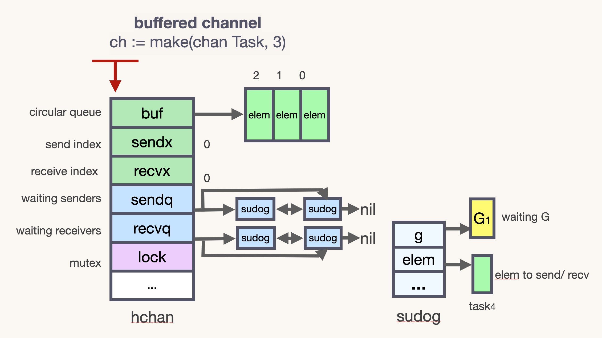
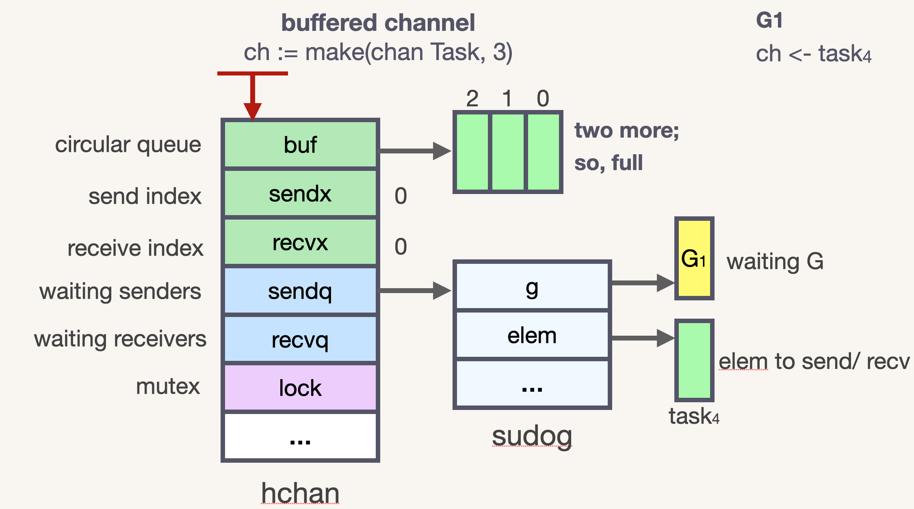

# 深入 Go 并发原语 — Channel 底层实现


## 1. 什么是 CSP ？

Go 语言的并发同步模型来自一个叫作通信顺序进程（Communicating Sequential Processes，CSP） 的范型（paradigm）。
CSP 是一种消息传递模型，通过在 goroutine 之间传递数据来传递消息，而不是对数据进行加锁来实现同步访问。
用于在 goroutine 之间同步和传递数据的关键数据类型叫作通道（channel）。


Do not communicate by sharing memory; instead, share memory by communicating.
## 不要通过共享内存进行通信。建议，通过通信来共享内存。

### 当一个资源需要在 goroutine 之间共享时，通道在 goroutine 之间架起了一个管道，并提供了确保同步交换数据的机制。

声明通道时，需要指定将要被共享的数据的类型。可以通过通道共享内置类型、命名类型、结构类型和引用类型的值或者指针。

#### 不要使用 sync 同步包组件实现并发编程、而是使用 channel 实现并发编程

Go 语言中，要传递某个数据给另一个goroutine(协程)，可以把这个数据封装成一个对象，然后把这个对象的指针传入某个 channel 中，另一个 goroutine 从这个 channel 中读出这个指针，并处理其指向的内存对象。Go从语言层面保证同一时间只有一个 goroutine 能访问 channel 中的数据，为开发者提供一种优雅简单的工具，所以 Go 的做法就是使用 channel 来通信，通过通信来传递内存数据，使得内存数据在不同 goroutine 中传递，而不是使用共享内存来通信。


### 1. 推荐使用 sync 包的 2 种情况：

- 对性能要求极高的临界区
- 保护某个结构内部状态和完整性
关于保护某个结构内部的状态和完整性。例如 Go 源码中如下代码：

```go
var sum struct {
	sync.Mutex
	i int
}

//export Add
func Add(x int) {
	defer func() {
		recover()
	}()
	sum.Lock()
	sum.i += x
	sum.Unlock()
	var p *int
	*p = 2
}
```
sum 这个结构体不想将内部的变量暴露在结构体之外，所以使用 sync.Mutex 来保护线程安全。

### 推荐使用 channel 的 2 种情况：

- 输出数据给其他使用方
- 组合多个逻辑
输出数据给其他使用方的目的是转移数据的使用权。并发安全的实质是保证同时只有一个并发上下文拥有数据的所有权。channel 可以很方便的将数据所有权转给其他使用方。另一个优势是组合型。如果使用 sync 里面的锁，想实现组合多个逻辑并且保证并发安全，是比较困难的。但是使用 channel + select 实现组合逻辑实在太方便了。以上就是 CSP 的基本概念和何时选择 channel 的时机。下一章从 channel 基本数据结构开始详细分析 channel 底层源码实现。


### 以下代码基于 Go 1.17


## 2. 基本数据结构
channel 的底层源码和相关实现在 src/runtime/chan.go 中。

```go
type hchan struct {
	qcount   uint           // total data in the queue
	dataqsiz uint           // size of the circular queue
	buf      unsafe.Pointer // points to an array of dataqsiz elements
	elemsize uint16
	closed   uint32
	elemtype *_type // element type
	sendx    uint   // send index
	recvx    uint   // receive index
	recvq    waitq  // list of recv waiters
	sendq    waitq  // list of send waiters

	// lock protects all fields in hchan, as well as several
	// fields in sudogs blocked on this channel.
	//
	// Do not change another G's status while holding this lock
	// (in particular, do not ready a G), as this can deadlock
	// with stack shrinking.
	lock mutex
}
```

lock 锁保护 hchan 中的所有字段，以及此通道上被阻塞的 sudogs 中的多个字段。
持有 lock 的时候，禁止更改另一个 G 的状态（特别是不要使 G 状态变成ready），因为这会因为堆栈 shrinking 而发生死锁。








recvq 和 sendq 是等待队列，waitq 是一个双向链表：

```go
type waitq struct {
	first *sudog
	last  *sudog
}
```

channel 最核心的数据结构是 sudog。sudog 代表了一个在等待队列中的 g。sudog 是 Go 中非常重要的数据结构，因为 g 与同步对象关系是多对多的。一个 g 可以出现在许多等待队列上，因此一个 g 可能有很多sudog。并且多个 g 可能正在等待同一个同步对象，因此一个对象可能有许多 sudog。sudog 是从特殊池中分配出来的。使用 acquireSudog 和 releaseSudog 分配和释放它们。


```go
// sudog represents a g in a wait list, such as for sending/receiving
// on a channel.
//
// sudog is necessary because the g ↔ synchronization object relation
// is many-to-many. A g can be on many wait lists, so there may be
// many sudogs for one g; and many gs may be waiting on the same
// synchronization object, so there may be many sudogs for one object.
//
// sudogs are allocated from a special pool. Use acquireSudog and
// releaseSudog to allocate and free them.
type sudog struct {
	// The following fields are protected by the hchan.lock of the
	// channel this sudog is blocking on. shrinkstack depends on
	// this for sudogs involved in channel ops.

	g *g

	next *sudog
	prev *sudog
	elem unsafe.Pointer // data element (may point to stack)

	// The following fields are never accessed concurrently.
	// For channels, waitlink is only accessed by g.
	// For semaphores, all fields (including the ones above)
	// are only accessed when holding a semaRoot lock.

	acquiretime int64
	releasetime int64
	ticket      uint32

	// isSelect indicates g is participating in a select, so
	// g.selectDone must be CAS'd to win the wake-up race.
	isSelect bool

	// success indicates whether communication over channel c
	// succeeded. It is true if the goroutine was awoken because a
	// value was delivered over channel c, and false if awoken
	// because c was closed.
	success bool

	parent   *sudog // semaRoot binary tree
	waitlink *sudog // g.waiting list or semaRoot
	waittail *sudog // semaRoot
	c        *hchan // channel
}
```

sudog 中所有字段都受 hchan.lock 保护。acquiretime、releasetime、ticket 这三个字段永远不会被同时访问。对 channel 来说，waitlink 只由 g 使用。对 semaphores 来说，只有在持有 semaRoot 锁的时候才能访问这三个字段。isSelect 表示 g 是否被选择，g.selectDone 必须进行 CAS 才能在被唤醒的竞争中胜出。success 表示 channel c 上的通信是否成功。如果 goroutine 在 channel c 上传了一个值而被唤醒，则为 true；如果因为 c 关闭而被唤醒，则为 false。


## 练习

1. 什么是 CSP
2. channel 底层的数据结构是什么
3. channel 发送和接收元素的本质是什么
4. 从 channel 接收数据的过程是怎样的
5. channel 在什么情况下会引起资源泄漏
6. channel 有哪些应用
7. 从一个关闭的 channel 仍然能读出数据吗
8. 关于 channel 的 happened-before 有哪些
9. 关闭一个 channel 的过程是怎样的
10. 向 channel 发送数据的过程是怎样的
11. 如何优雅地关闭 channel
12. 操作 channel 的情况总结
13. 手写 worker pool（goroutine池）


