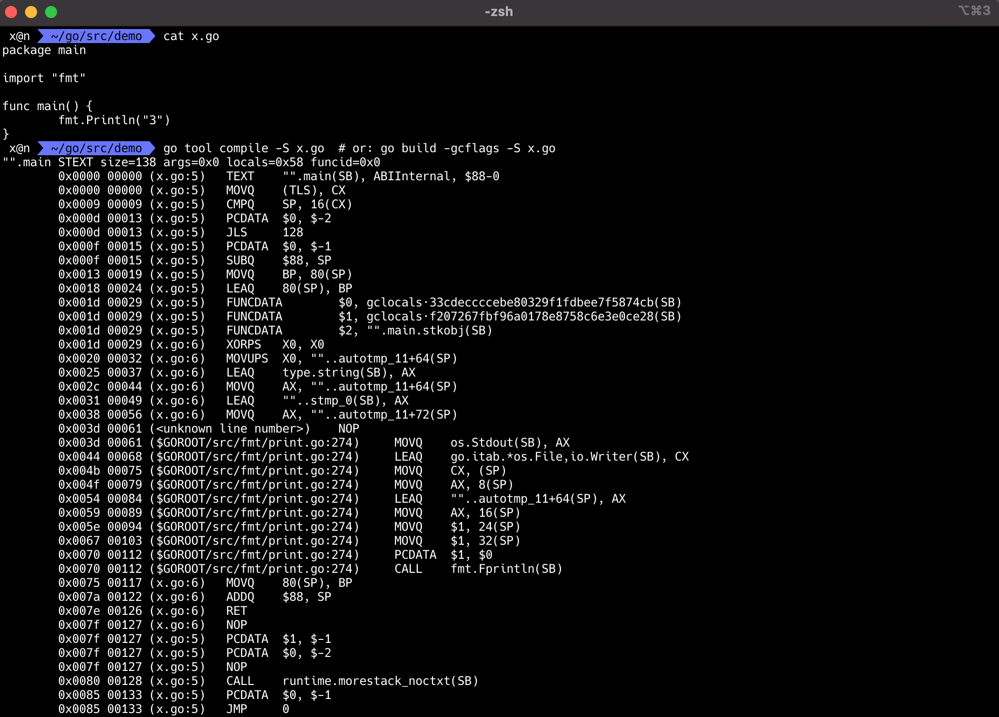

```go
$ cat x.go
package main

import "fmt"

func main() {
	fmt.Println("3")
}
$ go tool compile -S x.go  # or: go build -gcflags -S x.go
"".main STEXT size=138 args=0x0 locals=0x58 funcid=0x0
	0x0000 00000 (x.go:5)	TEXT	"".main(SB), ABIInternal, $88-0
	0x0000 00000 (x.go:5)	MOVQ	(TLS), CX
	0x0009 00009 (x.go:5)	CMPQ	SP, 16(CX)
	0x000d 00013 (x.go:5)	PCDATA	$0, $-2
	0x000d 00013 (x.go:5)	JLS	128
	0x000f 00015 (x.go:5)	PCDATA	$0, $-1
	0x000f 00015 (x.go:5)	SUBQ	$88, SP
	0x0013 00019 (x.go:5)	MOVQ	BP, 80(SP)
	0x0018 00024 (x.go:5)	LEAQ	80(SP), BP
	0x001d 00029 (x.go:5)	FUNCDATA	$0, gclocals·33cdeccccebe80329f1fdbee7f5874cb(SB)
	0x001d 00029 (x.go:5)	FUNCDATA	$1, gclocals·f207267fbf96a0178e8758c6e3e0ce28(SB)
	0x001d 00029 (x.go:5)	FUNCDATA	$2, "".main.stkobj(SB)
	0x001d 00029 (x.go:6)	XORPS	X0, X0
	0x0020 00032 (x.go:6)	MOVUPS	X0, ""..autotmp_11+64(SP)
	0x0025 00037 (x.go:6)	LEAQ	type.string(SB), AX
	0x002c 00044 (x.go:6)	MOVQ	AX, ""..autotmp_11+64(SP)
	0x0031 00049 (x.go:6)	LEAQ	""..stmp_0(SB), AX
	0x0038 00056 (x.go:6)	MOVQ	AX, ""..autotmp_11+72(SP)
	0x003d 00061 (<unknown line number>)	NOP
	0x003d 00061 ($GOROOT/src/fmt/print.go:274)	MOVQ	os.Stdout(SB), AX
	0x0044 00068 ($GOROOT/src/fmt/print.go:274)	LEAQ	go.itab.*os.File,io.Writer(SB), CX
	0x004b 00075 ($GOROOT/src/fmt/print.go:274)	MOVQ	CX, (SP)
	0x004f 00079 ($GOROOT/src/fmt/print.go:274)	MOVQ	AX, 8(SP)
	0x0054 00084 ($GOROOT/src/fmt/print.go:274)	LEAQ	""..autotmp_11+64(SP), AX
	0x0059 00089 ($GOROOT/src/fmt/print.go:274)	MOVQ	AX, 16(SP)
	0x005e 00094 ($GOROOT/src/fmt/print.go:274)	MOVQ	$1, 24(SP)
	0x0067 00103 ($GOROOT/src/fmt/print.go:274)	MOVQ	$1, 32(SP)
	0x0070 00112 ($GOROOT/src/fmt/print.go:274)	PCDATA	$1, $0
	0x0070 00112 ($GOROOT/src/fmt/print.go:274)	CALL	fmt.Fprintln(SB)
	0x0075 00117 (x.go:6)	MOVQ	80(SP), BP
	0x007a 00122 (x.go:6)	ADDQ	$88, SP
	0x007e 00126 (x.go:6)	RET
	0x007f 00127 (x.go:6)	NOP
	0x007f 00127 (x.go:5)	PCDATA	$1, $-1
	0x007f 00127 (x.go:5)	PCDATA	$0, $-2
	0x007f 00127 (x.go:5)	NOP
	0x0080 00128 (x.go:5)	CALL	runtime.morestack_noctxt(SB)
	0x0085 00133 (x.go:5)	PCDATA	$0, $-1
	0x0085 00133 (x.go:5)	JMP	0
```


```go
$ go build -o x x.go
$ go tool objdump -s main.main x
TEXT main.main(SB) /Users/x/go/src/demo/x.go
  x.go:5		0x10a3120		65488b0c2530000000	MOVQ GS:0x30, CX
  x.go:5		0x10a3129		483b6110		CMPQ 0x10(CX), SP
  x.go:5		0x10a312d		7671			JBE 0x10a31a0
  x.go:5		0x10a312f		4883ec58		SUBQ $0x58, SP
  x.go:5		0x10a3133		48896c2450		MOVQ BP, 0x50(SP)
  x.go:5		0x10a3138		488d6c2450		LEAQ 0x50(SP), BP
  x.go:6		0x10a313d		0f57c0			XORPS X0, X0
  x.go:6		0x10a3140		0f11442440		MOVUPS X0, 0x40(SP)
  x.go:6		0x10a3145		488d0594af0000		LEAQ type.*+44544(SB), AX
  x.go:6		0x10a314c		4889442440		MOVQ AX, 0x40(SP)
  x.go:6		0x10a3151		488d0538370400		LEAQ sync/atomic.CompareAndSwapUintptr.args_stackmap+192(SB), AX
  x.go:6		0x10a3158		4889442448		MOVQ AX, 0x48(SP)
  print.go:274		0x10a315d		488b05d4b70b00		MOVQ os.Stdout(SB), AX
  print.go:274		0x10a3164		488d0d9d4d0400		LEAQ go.itab.*os.File,io.Writer(SB), CX
  print.go:274		0x10a316b		48890c24		MOVQ CX, 0(SP)
  print.go:274		0x10a316f		4889442408		MOVQ AX, 0x8(SP)
  print.go:274		0x10a3174		488d442440		LEAQ 0x40(SP), AX
  print.go:274		0x10a3179		4889442410		MOVQ AX, 0x10(SP)
  print.go:274		0x10a317e		48c744241801000000	MOVQ $0x1, 0x18(SP)
  print.go:274		0x10a3187		48c744242001000000	MOVQ $0x1, 0x20(SP)
  print.go:274		0x10a3190		e88b9affff		CALL fmt.Fprintln(SB)
  x.go:6		0x10a3195		488b6c2450		MOVQ 0x50(SP), BP
  x.go:6		0x10a319a		4883c458		ADDQ $0x58, SP
  x.go:6		0x10a319e		c3			RET
  x.go:5		0x10a319f		90			NOPL
  x.go:5		0x10a31a0		e8dbf3fbff		CALL runtime.morestack_noctxt(SB)
  x.go:5		0x10a31a5		e976ffffff		JMP main.main(SB)
```