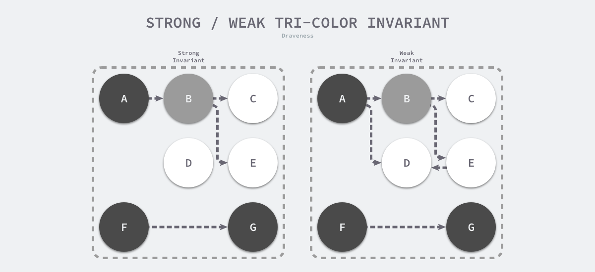

1. [什么是 GC，有什么作用？](#什么是-gc有什么作用)
2. [根对象到底是什么？](#根对象到底是什么)
3. [常见的 GC 实现方式有哪些？Go 语言的 GC 使用的是什么？](#常见的-gc-实现方式有哪些go-语言的-gc-使用的是什么)
4. [三色标记法是什么？](#三色标记法是什么)
5. [STW 是什么意思？](#stw-是什么意思)
6. [如何观察 Go GC？](#如何观察-go-gc)
7. [有了 GC，为什么还会发生内存泄露？](#有了-gc为什么还会发生内存泄露)
8. [隔离屏障和混合写屏障到底有什么区别？](#隔离屏障和混合写屏障到底有什么区别)


## 什么是 GC，有什么作用？

GC，全称 Garbage Collection，即垃圾回收，是一种自动内存管理的机制。
当程序向操作系统申请的内存不再需要时，垃圾回收主动将其回收并供其他代码进行内存申请时候复用，或者将其归还给操作系统，这种针对内存级别资源的自动回收过程，即为垃圾回收。而负责垃圾回收的程序组件，即为垃圾回收器。
垃圾回收其实一个完美的 “Simplicity is Complicated” 的例子。一方面，程序员受益于 GC，无需操心、也不再需要对内存进行手动的申请和释放操作，GC 在程序运行时自动释放残留的内存。另一方面，GC 对程序员几乎不可见，仅在程序需要进行特殊优化时，通过提供可调控的 API，对 GC 的运行时机、运行开销进行把控的时候才得以现身。
通常，垃圾回收器的执行过程被划分为两个半独立的组件：

- 赋值器（Mutator）：这一名称本质上是在指代用户态的代码。因为对垃圾回收器而言，用户态的代码仅仅只是在修改对象之间的引用关系，也就是在对象图（对象之间引用关系的一个有向图）上进行操作。
- 回收器（Collector）：负责执行垃圾回收的代码。


## 根对象到底是什么？

根对象在垃圾回收的术语中又叫做根集合，它是垃圾回收器在标记过程时最先检查的对象，包括：
- 全局变量：程序在编译期就能确定的那些存在于程序整个生命周期的变量。
- 执行栈：每个 goroutine 都包含自己的执行栈，这些执行栈上包含栈上的变量及指向分配的堆内存区块的指针。
- 寄存器：寄存器的值可能表示一个指针，参与计算的这些指针可能指向某些赋值器分配的堆内存区块。

## 常见的 GC 实现方式有哪些？Go 语言的 GC 使用的是什么？

所有的 GC 算法其存在形式可以归结为追踪（Tracing）和引用计数（Reference Counting）这两种形式的混合运用。

- 追踪式 GC
  
从根对象出发，根据对象之间的引用信息，一步步推进直到扫描完毕整个堆并确定需要保留的对象，从而回收所有可回收的对象。Go、 Java、V8 对 JavaScript 的实现等均为追踪式 GC。

- 引用计数式 GC
  
每个对象自身包含一个被引用的计数器，当计数器归零时自动得到回收。因为此方法缺陷较多，在追求高性能时通常不被应用。Python、Objective-C 等均为引用计数式 GC。


**目前比较常见的 GC 实现方式包括：**

- 追踪式，分为多种不同类型，例如：
    - 标记清扫：从根对象出发，将确定存活的对象进行标记，并清扫可以回收的对象。
    - 标记整理：为了解决内存碎片问题而提出，在标记过程中，将对象尽可能整理到一块连续的内存上。
    - 增量式：将标记与清扫的过程分批执行，每次执行很小的部分，从而增量的推进垃圾回收，达到近似实时、几乎无停顿的目的。
    - 增量整理：在增量式的基础上，增加对对象的整理过程。
    - 分代式：将对象根据存活时间的长短进行分类，存活时间小于某个值的为年轻代，存活时间大于某个值的为老年代，永远不会参与回收的对象为永久代。并根据分代假设（如果一个对象存活时间不长则倾向于被回收，如果一个对象已经存活很长时间则倾向于存活更长时间）对对象进行回收。
- 引用计数：根据对象自身的引用计数来回收，当引用计数归零时立即回收。

1. 关于各类方法的详细介绍及其实现不在本文中详细讨论。对于 Go 而言，Go 的 GC 目前使用的是无分代（对象没有代际之分）、不整理（回收过程中不对对象进行移动与整理）、并发（与用户代码并发执行）的三色标记清扫算法。原因[1]在于：
对象整理的优势是解决内存碎片问题以及“允许”使用顺序内存分配器。但 Go 运行时的分配算法基于 tcmalloc，基本上没有碎片问题。 并且顺序内存分配器在多线程的场景下并不适用。Go 使用的是基于 tcmalloc 的现代内存分配算法，对对象进行整理不会带来实质性的性能提升。

2. 分代 GC 依赖分代假设，即 GC 将主要的回收目标放在新创建的对象上（存活时间短，更倾向于被回收），而非频繁检查所有对象。但 Go 的编译器会通过逃逸分析将大部分新生对象存储在栈上（栈直接被回收），只有那些需要长期存在的对象才会被分配到需要进行垃圾回收的堆中。也就是说，分代 GC 回收的那些存活时间短的对象在 Go 中是直接被分配到栈上，当 goroutine 死亡后栈也会被直接回收，不需要 GC 的参与，进而分代假设并没有带来直接优势。并且 Go 的垃圾回收器与用户代码并发执行，使得 STW 的时间与对象的代际、对象的 size 没有关系。Go 团队更关注于如何更好地让 GC 与用户代码并发执行（使用适当的 CPU 来执行垃圾回收），而非减少停顿时间这一单一目标上。

## 三色标记法是什么？

理解三色标记法的关键是理解对象的三色抽象以及波面（wavefront）推进这两个概念。三色抽象只是一种描述追踪式回收器的方法，在实践中并没有实际含义，它的重要作用在于从逻辑上严密推导标记清理这种垃圾回收方法的正确性。也就是说，当我们谈及三色标记法时，通常指标记清扫的垃圾回收。

从垃圾回收器的视角来看，三色抽象规定了三种不同类型的对象，并用不同的颜色相称：

- 白色对象（可能死亡）：未被回收器访问到的对象。在回收开始阶段，所有对象均为白色，当回收结束后，白色对象均不可达。
- 灰色对象（波面）：已被回收器访问到的对象，但回收器需要对其中的一个或多个指针进行扫描，因为他们可能还指向白色对象。
- 黑色对象（确定存活）：已被回收器访问到的对象，其中所有字段都已被扫描，黑色对象中任何一个指针都不可能直接指向白色对象。
    
这样三种不变性所定义的回收过程其实是一个波面不断前进的过程，这个波面同时也是黑色对象和白色对象的边界，灰色对象就是这个波面。

当垃圾回收开始时，只有白色对象。随着标记过程开始进行时，灰色对象开始出现（着色），这时候波面便开始扩大。当一个对象的所有子节点均完成扫描时，会被着色为黑色。当整个堆遍历完成时，只剩下黑色和白色对象，这时的黑色对象为可达对象，即存活；而白色对象为不可达对象，即死亡。这个过程可以视为以灰色对象为波面，将黑色对象和白色对象分离，使波面不断向前推进，直到所有可达的灰色对象都变为黑色对象为止的过程。

## STW 是什么意思？

STW 可以是 Stop the World 的缩写，也可以是 Start the World 的缩写。通常意义上指指代从 Stop the World 这一动作发生时到 Start the World 这一动作发生时这一段时间间隔，即万物静止。STW 在垃圾回收过程中为了保证实现的正确性、防止无止境的内存增长等问题而不可避免的需要停止赋值器进一步操作对象图的一段过程。

在这个过程中整个用户代码被停止或者放缓执行， STW 越长，对用户代码造成的影响（例如延迟）就越大，早期 Go 对垃圾回收器的实现中 STW 长达几百毫秒，对时间敏感的实时通信等应用程序会造成巨大的影响。我们来看一个例子：

```go
package main

import (
	"runtime"
	"time"
)

func main() {
	go func() {
		for {
		}
	}()
	time.Sleep(time.Millisecond)
	runtime.GC()
	println("OK")
}
// OK
```

上面的这个程序在 Go 1.14 以前永远都不会输出 OK，其罪魁祸首是进入 STW 这一操作的执行无限制的被延长。

尽管 STW 如今已经优化到了半毫秒级别以下，但这个程序被卡死原因是由于需要进入 STW 导致的。原因在于，GC 在需要进入 STW 时，需要通知并让所有的用户态代码停止，但是 for {} 所在的 goroutine 永远都不会被中断，从而始终无法进入 STW 阶段。实际实践中也是如此，当程序的某个 goroutine 长时间得不到停止，强行拖慢进入 STW 的时机，这种情况下造成的影响（卡死）是非常可怕的。好在自 Go 1.14 之后，这类 goroutine 能够被异步地抢占，从而使得进入 STW 的时间不会超过抢占信号触发的周期，程序也不会因为仅仅等待一个 goroutine 的停止而停顿在进入 STW 之前的操作上。

## 如何观察 Go GC？

我们以下面的程序为例，先使用四种不同的方式来介绍如何观察 GC，并在后面的问题中通过几个详细的例子再来讨论如何优化 GC。

```go
package main

func allocate() {
	_ = make([]byte, 1<<20)
}
func main() {
	for i := 1; i < 100; i++ {
		allocate()
	}
}
```


**方式1：GODEBUG=gctrace=1**

我们首先可以通过

```go
➜  demo02 git:(main) ✗ go build -o main        
➜  demo02 git:(main) ✗ GODEBUG=gctrace=1 ./main
gc 1 @0.000s 8%: 0.017+0.34+0.025 ms clock, 0.068+0.13/0.043/0+0.10 ms cpu, 4->4->0 MB, 4 MB goal, 0 MB stacks, 0 MB globals, 4 P
gc 2 @0.003s 3%: 0.009+0.12+0.003 ms clock, 0.038+0.089/0/0+0.013 ms cpu, 4->4->0 MB, 4 MB goal, 0 MB stacks, 0 MB globals, 4 P
gc 3 @0.004s 3%: 0.013+0.13+0.003 ms clock, 0.052+0.091/0/0+0.014 ms cpu, 4->4->0 MB, 4 MB goal, 0 MB stacks, 0 MB globals, 4 P
gc 4 @0.005s 3%: 0.012+0.30+0.002 ms clock, 0.048+0.082/0/0+0.010 ms cpu, 4->4->0 MB, 4 MB goal, 0 MB stacks, 0 MB globals, 4 P
gc 5 @0.006s 8%: 0.42+0.32+0.002 ms clock, 1.7+0.094/0/0+0.009 ms cpu, 4->4->0 MB, 4 MB goal, 0 MB stacks, 0 MB globals, 4 P
gc 6 @0.008s 9%: 0.14+0.23+0.002 ms clock, 0.56+0.10/0/0+0.011 ms cpu, 4->4->0 MB, 4 MB goal, 0 MB stacks, 0 MB globals, 4 P
gc 7 @0.009s 9%: 0.044+0.31+0.004 ms clock, 0.17+0.10/0/0+0.018 ms cpu, 4->4->0 MB, 4 MB goal, 0 MB stacks, 0 MB globals, 4 P
gc 8 @0.010s 8%: 0.039+0.23+0.002 ms clock, 0.15+0.10/0/0+0.010 ms cpu, 4->4->0 MB, 4 MB goal, 0 MB stacks, 0 MB globals, 4 P
gc 9 @0.011s 9%: 0.28+0.52+0.009 ms clock, 1.1+0.087/0/0+0.036 ms cpu, 4->4->0 MB, 4 MB goal, 0 MB stacks, 0 MB globals, 4 P
gc 10 @0.013s 11%: 0.44+0.90+0.003 ms clock, 1.7+0.084/0/0+0.013 ms cpu, 4->4->0 MB, 4 MB goal, 0 MB stacks, 0 MB globals, 4 P
gc 11 @0.015s 16%: 1.1+0.13+0.002 ms clock, 4.4+0.086/0/0+0.008 ms cpu, 4->4->0 MB, 4 MB goal, 0 MB stacks, 0 MB globals, 4 P
gc 12 @0.018s 17%: 0.51+0.74+0.003 ms clock, 2.0+0.10/0/0+0.014 ms cpu, 4->4->0 MB, 4 MB goal, 0 MB stacks, 0 MB globals, 4 P
gc 13 @0.020s 18%: 0.57+0.34+0.004 ms clock, 2.3+0.094/0/0+0.016 ms cpu, 4->4->0 MB, 4 MB goal, 0 MB stacks, 0 MB globals, 4 P
gc 14 @0.022s 18%: 0.037+0.53+0.051 ms clock, 0.14+0.074/0/0+0.20 ms cpu, 4->4->0 MB, 4 MB goal, 0 MB stacks, 0 MB globals, 4 P
gc 15 @0.023s 18%: 0.14+0.13+0.010 ms clock, 0.59+0.069/0/0+0.042 ms cpu, 4->4->0 MB, 4 MB goal, 0 MB stacks, 0 MB globals, 4 P
gc 16 @0.024s 17%: 0.13+0.52+0.004 ms clock, 0.54+0.090/0/0+0.016 ms cpu, 4->4->0 MB, 4 MB goal, 0 MB stacks, 0 MB globals, 4 P
gc 17 @0.026s 18%: 0.47+0.31+0.002 ms clock, 1.8+0.068/0/0+0.010 ms cpu, 4->4->0 MB, 4 MB goal, 0 MB stacks, 0 MB globals, 4 P
gc 18 @0.027s 18%: 0.036+0.19+0.002 ms clock, 0.14+0.069/0/0+0.011 ms cpu, 4->4->0 MB, 4 MB goal, 0 MB stacks, 0 MB globals, 4 P
gc 19 @0.028s 17%: 0.055+0.18+0.002 ms clock, 0.22+0.069/0/0+0.010 ms cpu, 4->4->0 MB, 4 MB goal, 0 MB stacks, 0 MB globals, 4 P
gc 20 @0.029s 17%: 0.038+0.10+0.007 ms clock, 0.15+0.072/0/0+0.031 ms cpu, 4->4->0 MB, 4 MB goal, 0 MB stacks, 0 MB globals, 4 P
gc 21 @0.030s 18%: 0.46+0.19+0.002 ms clock, 1.8+0.072/0/0+0.011 ms cpu, 4->4->0 MB, 4 MB goal, 0 MB stacks, 0 MB globals, 4 P
gc 22 @0.031s 18%: 0.13+0.23+0.002 ms clock, 0.52+0.069/0/0+0.011 ms cpu, 4->4->0 MB, 4 MB goal, 0 MB stacks, 0 MB globals, 4 P
gc 23 @0.032s 17%: 0.038+0.27+0.002 ms clock, 0.15+0.081/0/0+0.010 ms cpu, 4->4->0 MB, 4 MB goal, 0 MB stacks, 0 MB globals, 4 P
gc 24 @0.033s 17%: 0.071+0.14+0.002 ms clock, 0.28+0.078/0/0+0.008 ms cpu, 4->4->0 MB, 4 MB goal, 0 MB stacks, 0 MB globals, 4 P
```


**方式2：go tool trace**

go tool trace 的主要功能是将统计而来的信息以一种可视化的方式展示给用户。要使用此工具，可以通过调用 trace API：

```go
package main

func main() {
    f, _ := os.Create("trace.out")
    defer f.Close()
    trace.Start(f)
    defer trace.Stop()
    (...)
}
```


## 有了 GC，为什么还会发生内存泄露？

在一个具有 GC 的语言中，我们常说的内存泄漏，用严谨的话来说应该是：预期的能很快被释放的内存由于附着在了长期存活的内存上、或生命期意外地被延长，导致预计能够立即回收的内存而长时间得不到回收。
在 Go 中，由于 goroutine 的存在，所谓的内存泄漏除了附着在长期对象上之外，还存在多种不同的形式。

**形式1：预期能被快速释放的内存因被根对象引用而没有得到迅速释放**

当有一个全局对象时，可能不经意间将某个变量附着在其上，且忽略的将其进行释放，则该内存永远不会得到释放。例如：

```go
var cache = map[interface{}]interface{}{}

func keepalloc() {
    for i := 0; i < 10000; i++ {
        m := make([]byte, 1<<10)
        cache[i] = m
    }
}
```


## 隔离屏障和混合写屏障到底有什么区别？

本来不应该被回收的对象却被回收了，这在内存管理中是非常严重的错误，我们将这种错误称为悬挂指针，即指针没有指向特定类型的合法对象，影响了内存的安全性5，想要并发或者增量地标记对象还是需要使用屏障技术。


**三色抽象** 

为了解决原始标记清除算法带来的长时间 STW，多数现代的追踪式垃圾收集器都会实现三色标记算法的变种以缩短 STW 的时间。三色标记算法将程序中的对象分成白色、黑色和灰色三类：

- 白色对象 — 潜在的垃圾，其内存可能会被垃圾收集器回收；
- 黑色对象 — 活跃的对象，包括不存在任何引用外部指针的对象以及从根对象可达的对象；
- 灰色对象 — 活跃的对象，因为存在指向白色对象的外部指针，垃圾收集器会扫描这些对象的子对象；

**屏障技术** 

内存屏障技术是一种屏障指令，它可以让 CPU 或者编译器在执行内存相关操作时遵循特定的约束，目前多数的现代处理器都会乱序执行指令以最大化性能，但是该技术能够保证内存操作的顺序性，在内存屏障前执行的操作一定会先于内存屏障后执行的操作。

想要在并发或者增量的标记算法中保证正确性，我们需要达成以下两种三色不变性（Tri-color invariant）中的一种：

- 强三色不变性 — 黑色对象不会指向白色对象，只会指向灰色对象或者黑色对象；
- 弱三色不变性 — 黑色对象指向的白色对象必须包含一条从灰色对象经由多个白色对象的可达路径；




上图分别展示了**遵循强三色不变性和弱三色不变性的堆内存，遵循上述两个不变性中的任意一个，我们都能保证垃圾收集算法的正确性，而屏障技术就是在并发或者增量标记过程中保证三色不变性的重要技术。**

垃圾收集中的屏障技术更像是一个钩子方法，它是在用户程序读取对象、创建新对象以及更新对象指针时执行的一段代码，根据操作类型的不同，我们可以将它们分成读屏障（Read barrier）和写屏障（Write barrier）两种，因为读屏障需要在读操作中加入代码片段，对用户程序的性能影响很大，所以编程语言往往都会采用写屏障保证三色不变性。

我们在这里想要介绍的是 Go 语言中使用的两种写屏障技术，分别是 Dijkstra 提出的插入写屏障8和 Yuasa 提出的删除写屏障9，这里会分析它们如何保证三色不变性和垃圾收集器的正确性。


**增量和并发**

传统的垃圾收集算法会在垃圾收集的执行期间暂停应用程序，一旦触发垃圾收集，垃圾收集器会抢占 CPU 的使用权占据大量的计算资源以完成标记和清除工作，然而很多追求实时的应用程序无法接受长时间的 STW。

远古时代的计算资源还没有今天这么丰富，今天的计算机往往都是多核的处理器，垃圾收集器一旦开始执行就会浪费大量的计算资源，为了减少应用程序暂停的最长时间和垃圾收集的总暂停时间，我们会使用下面的策略优化现代的垃圾收集器：

- 增量垃圾收集 — 增量地标记和清除垃圾，降低应用程序暂停的最长时间；
- 并发垃圾收集 — 利用多核的计算资源，在用户程序执行时并发标记和清除垃圾；

因为增量和并发两种方式都可以与用户程序交替运行，所以我们需要使用屏障技术保证垃圾收集的正确性；与此同时，应用程序也不能等到内存溢出时触发垃圾收集，因为当内存不足时，应用程序已经无法分配内存，这与直接暂停程序没有什么区别，增量和并发的垃圾收集需要提前触发并在内存不足前完成整个循环，避免程序的长时间暂停。


