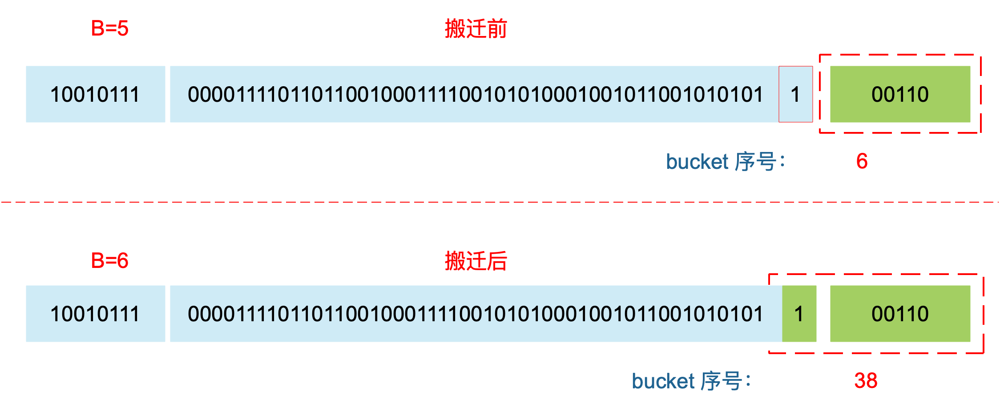

1. [map 是线程安全的吗?](#map-是线程安全的吗)
2. [在函数间传递映射](#在函数间传递映射)
3. [可以边遍历边删除吗?](#可以边遍历边删除吗)
4. [map 的删除过程是怎样的?](#map-的删除过程是怎样的)
5. [可以对 map 的元素取地址吗?](#可以对-map-的元素取地址吗)
6. [如何比较两个 map 相等?](#如何比较两个-map-相等)
7. [如何实现两种 get 操作?](#如何实现两种-get-操作)
8. [map 的遍历过程是怎样的?](#map-的遍历过程是怎样的)
9. [map 中的 key 为什么是无序的?](#map-中的-key-为什么是无序的)
10. [float 类型可以作为 map 的 key 吗？](#float-类型可以作为-map-的-key-吗)
11. [map 的赋值过程是怎样的?](#map-的赋值过程是怎样的)
12. [map 的扩容过程是怎样的 ?](#map-的扩容过程是怎样的-)


## map 是线程安全的吗?

map 不是线程安全的。
在查找、赋值、遍历、删除的过程中都会检测写标志，一旦发现写标志置位（等于1），则直接 panic。赋值和删除函数在检测完写标志是复位之后，先将写标志位置位，才会进行之后的操作。
检测写标志：

```go
	// 如果多线程读写，直接抛出异常
	// 并发检查 go hashmap 不支持并发访问
	if h.flags&hashWriting != 0 {
		throw("concurrent map read and map write")
	}
```

设置写标志：

```go
	// Set hashWriting after calling t.hasher, since t.hasher may panic,
	// in which case we have not actually done a write.
	// 在计算完 hash 值以后立即设置 hashWriting 变量的值，如果在计算 hash 值的过程中没有完全写完，可能会导致 panic
	h.flags ^= hashWriting
```

## 在函数间传递映射

在函数间传递映射并不会制造出该映射的一个副本。实际上，当传递映射给一个函数，并对这个映射做了修改时，所有对这个映射的引用都会察觉到这个修改。
这个特性和切片类似，保证可以用很小的成本来复制映射。

将切片或者映射传递给函数成本很小，并且不会复制底层的数据结构。

## 可以边遍历边删除吗?

map 并不是一个线程安全的数据结构。同时读写一个 map 是未定义的行为，如果被检测到，会直接 panic。
上面说的是发生在多个协程同时读写同一个 map 的情况下。 如果在同一个协程内边遍历边删除，并不会检测到同时读写，理论上是可以这样做的。但是，遍历的结果就可能不会是相同的了，有可能结果遍历结果集中包含了删除的 key，也有可能不包含，这取决于删除 key 的时间：是在遍历到 key 所在的 bucket 时刻前或者后。
一般而言，这可以通过读写锁来解决：sync.RWMutex。
读之前调用 RLock() 函数，读完之后调用 RUnlock() 函数解锁；写之前调用 Lock() 函数，写完之后，调用 Unlock() 解锁。
另外，sync.Map 是线程安全的 map，也可以使用。


## map 的删除过程是怎样的?

map 的删除操作底层的执行函数是 mapdelete：

```go
func mapdelete(t *maptype, h *hmap, key unsafe.Pointer) { }
```
首先会检查 h.flags 标志，如果发现写标位是 1，直接 panic，因为这表明有其他协程同时在进行写操作。
计算 key 的哈希，找到落入的 bucket。检查此 map 如果正在扩容的过程中，直接触发一次搬迁操作。
删除操作同样是两层循环，核心还是找到 key 的具体位置。寻找过程都是类似的，在 bucket 中挨个 cell 寻找。
找到对应位置后，对 key 或者 value 进行“清零”操作：

```go
// Only clear key if there are pointers in it.
// 对 key 清零
			if t.indirectkey() {
				// key 的指针置空
				*(*unsafe.Pointer)(k) = nil
			} else if t.key.ptrdata != 0 {
				// 清除 key 的内存
				memclrHasPointers(k, t.key.size)
			}
// 对 value 清零			
			if t.indirectelem() {
				// value 的指针置空
				*(*unsafe.Pointer)(e) = nil
			} else if t.elem.ptrdata != 0 {
				// 清除 value 的内存
				memclrHasPointers(e, t.elem.size)
			} else {
				memclrNoHeapPointers(e, t.elem.size)
			}

// 清空 tophash 里面的值
			b.tophash[i] = emptyOne

// map 里面 key 的总个数减1
			h.count--
```
最后，将 count 值减 1，将对应位置的 tophash 值置成 Empty。

## 可以对 map 的元素取地址吗?

无法对 map 的 key 或 value 进行取址。以下代码不能通过编译：

```go
package main

import "fmt"

func main() {
    m := make(map[string]int)

    fmt.Println(&m["qcrao"])
}
```
编译报错：
```
➜  map git:(main) ✗ go run main.go 
# command-line-arguments
./main.go:8:18: invalid operation: cannot take address of m["qcrao"] (map index expression of type int)
```

如果通过其他 hack 的方式，例如 unsafe.Pointer 等获取到了 key 或 value 的地址，也不能长期持有，因为一旦发生扩容，key 和 value 的位置就会改变，之前保存的地址也就失效了。


## 如何比较两个 map 相等?

map 深度相等的条件：

```go
都为 nil
非空、长度相等，指向同一个 map 实体对象
相应的 key 指向的 value “深度”相等
```

直接将使用 map1 == map2 是错误的。这种写法只能比较 map 是否为 nil。

```go
package main

import "fmt"

func main() {
    var m map[string]int
    var n map[string]int

    fmt.Println(m == nil)
    fmt.Println(n == nil)

    // 不能通过编译
    fmt.Println(m == n)
}
```

输出结果：
```go
 // ./main2.go:13:14: invalid operation: m == n (map can only be compared to nil)

```

因此只能是遍历map 的每个元素，比较元素是否都是深度相等。

## 如何实现两种 get 操作?

Go 语言中读取 map 有两种语法：带 comma 和 不带 comma。当要查询的 key 不在 map 里，带 comma 的用法会返回一个 bool 型变量提示 key 是否在 map 中；而不带 comma 的语句则会返回一个 key 类型的零值。如果 key 是 int 型就会返回 0，如果 key 是 string 类型，就会返回空字符串。

```go
package main

import "fmt"

func main() {
    ageMap := make(map[string]int)
    ageMap["qcrao"] = 18

    // 不带 comma 用法
    age1 := ageMap["stefno"]
    fmt.Println(age1)

    // 带 comma 用法
    age2, ok := ageMap["stefno"]
    fmt.Println(age2, ok)
}
```

运行结果：

```go
0
0 false
```

以前一直觉得好神奇，怎么实现的？这其实是编译器在背后做的工作：分析代码后，将两种语法对应到底层两个不同的函数。

```go
// src/runtime/hashmap.go
func mapaccess1(t *maptype, h *hmap, key unsafe.Pointer) unsafe.Pointer
func mapaccess2(t *maptype, h *hmap, key unsafe.Pointer) (unsafe.Pointer, bool)
```

源码里，函数命名不拘小节，直接带上后缀 1，2，完全不理会《代码大全》里的那一套命名的做法。从上面两个函数的声明也可以看出差别了，mapaccess2 函数返回值多了一个 bool 型变量，两者的代码也是完全一样的，只是在返回值后面多加了一个 false 或者 true。
另外，根据 key 的不同类型，编译器还会将查找、插入、删除的函数用更具体的函数替换，以优化效率：

这些函数的参数类型直接是具体的 uint32、unt64、string，在函数内部由于提前知晓了 key 的类型，所以内存布局是很清楚的，因此能节省很多操作，提高效率。
上面这些函数都是在文件 src/runtime/hashmap_fast.go 里。


## map 的遍历过程是怎样的?

本来 map 的遍历过程比较简单：遍历所有的 bucket 以及它后面挂的 overflow bucket，然后挨个遍历 bucket 中的所有 cell。每个 bucket 中包含 8 个 cell，从有 key 的 cell 中取出 key 和 value，这个过程就完成了。
但是，现实并没有这么简单。还记得前面讲过的扩容过程吗？扩容过程不是一个原子的操作，它每次最多只搬运 2 个 bucket，所以如果触发了扩容操作，那么在很长时间里，map 的状态都是处于一个中间态：有些 bucket 已经搬迁到新家，而有些 bucket 还待在老地方。
因此，遍历如果发生在扩容的过程中，就会涉及到遍历新老 bucket 的过程，这是难点所在。
我先写一个简单的代码样例，假装不知道遍历过程具体调用的是什么函数：

```go
package main

import "fmt"

func main() {
    ageMp := make(map[string]int)
    ageMp["qcrao"] = 18

    for name, age := range ageMp {
        fmt.Println(name, age)
    }
}
```

执行命令：

```go
go tool compile -S main.go
```


**todo**


## map 中的 key 为什么是无序的?


map 在扩容后，会发生 key 的搬迁，原来落在同一个 bucket 中的 key，搬迁后，有些 key 就要远走高飞了（bucket 序号加上了 2^B）。而遍历的过程，就是按顺序遍历 bucket，同时按顺序遍历 bucket 中的 key。搬迁后，key 的位置发生了重大的变化，有些 key 飞上高枝，有些 key 则原地不动。这样，遍历 map 的结果就不可能按原来的顺序了。
当然，如果我就一个 hard code 的 map，我也不会向 map 进行插入删除的操作，按理说每次遍历这样的 map 都会返回一个固定顺序的 key/value 序列吧。的确是这样，但是 Go 杜绝了这种做法，因为这样会给新手程序员带来误解，以为这是一定会发生的事情，在某些情况下，可能会酿成大错。
当然，Go 做得更绝，当我们在遍历 map 时，并不是固定地从 0 号 bucket 开始遍历，每次都是从一个随机值序号的 bucket 开始遍历，并且是从这个 bucket 的一个随机序号的 cell 开始遍历。这样，即使你是一个写死的 map，仅仅只是遍历它，也不太可能会返回一个固定序列的 key/value 对了。
多说一句，“迭代 map 的结果是无序的”这个特性是从 go 1.0 开始加入的。


## float 类型可以作为 map 的 key 吗？

从语法上看，是可以的。Go 语言中只要是可比较的类型都可以作为 key。除开 slice，map，functions 这几种类型，其他类型都是 OK 的。具体包括：布尔值、数字、字符串、指针、通道、接口类型、结构体、只包含上述类型的数组。这些类型的共同特征是支持 == 和 != 操作符，k1 == k2 时，可认为 k1 和 k2 是同一个 key。如果是结构体，只有 hash 后的值相等以及字面值相等，才被认为是相同的 key。很多字面值相等的，hash出来的值不一定相等，比如引用。
顺便说一句，任何类型都可以作为 value，包括 map 类型。

来看个例子：
```go
package main

import (
	"fmt"
	"math"
)

func main() {
	m := make(map[float64]int)
	m[1.4] = 1
	m[2.4] = 2
	m[math.NaN()] = 3
	m[math.NaN()] = 3

	for k, v := range m {
		fmt.Printf("[%v, %d] ", k, v)
	}

	fmt.Printf("\nk: %v, v: %d\n", math.NaN(), m[math.NaN()])
	fmt.Printf("k: %v, v: %d\n", 2.400000000001, m[2.400000000001])
	fmt.Printf("k: %v, v: %d\n", 2.4000000000000000000000001, m[2.4000000000000000000000001])

	fmt.Println(math.NaN() == math.NaN())
}

```

程序的输出：
```go
[1.4, 1] [2.4, 2] [NaN, 3] [NaN, 3] 
k: NaN, v: 0
k: 2.400000000001, v: 0
k: 2.4, v: 2
false
```

f != f 就是针对 NAN，这里会再加一个随机数。

```go
NAN != NAN
hash(NAN) != hash(NAN)
```


float 型可以作为 key，但是由于精度的问题，会导致一些诡异的问题，慎用之。
关于当 key 是引用类型时，判断两个 key 是否相等，需要 hash 后的值相等并且 key 的字面量相等。


## map 的赋值过程是怎样的?

通过汇编语言可以看到，向 map 中插入或者修改 key，最终调用的是 mapassign 函数。
实际上插入或修改 key 的语法是一样的，只不过前者操作的 key 在 map 中不存在，而后者操作的 key 存在 map 中。

我们只用研究最一般的赋值函数 mapassign。
整体来看，流程非常得简单：对 key 计算 hash 值，根据 hash 值按照之前的流程，找到要赋值的位置（可能是插入新 key，也可能是更新老 key），对相应位置进行赋值。
源码大体和之前讲的类似，核心还是一个双层循环，外层遍历 bucket 和它的 overflow bucket，内层遍历整个 bucket 的各个 cell。

我这里会针对这个过程提几点重要的。
函数首先会检查 map 的标志位 flags。如果 flags 的写标志位此时被置 1 了，说明有其他协程在执行“写”操作，进而导致程序 panic。这也说明了 map 对协程是不安全的。
通过前文我们知道扩容是渐进式的，如果 map 处在扩容的过程中，那么当 key 定位到了某个 bucket 后，需要确保这个 bucket 对应的老 bucket 完成了迁移过程。即老 bucket 里的 key 都要迁移到新的 bucket 中来（分裂到 2 个新 bucket），才能在新的 bucket 中进行插入或者更新的操作。
上面说的操作是在函数靠前的位置进行的，只有进行完了这个搬迁操作后，我们才能放心地在新 bucket 里定位 key 要安置的地址，再进行之后的操作。
现在到了定位 key 应该放置的位置了，所谓找准自己的位置很重要。准备两个指针，一个（inserti）指向 key 的 hash 值在 tophash 数组所处的位置，另一个(insertk)指向 cell 的位置（也就是 key 最终放置的地址），当然，对应 value 的位置就很容易定位出来了。这三者实际上都是关联的，在 tophash 数组中的索引位置决定了 key 在整个 bucket 中的位置（共 8 个 key），而 value 的位置需要“跨过” 8 个 key 的长度。
在循环的过程中，inserti 和 insertk 分别指向第一个找到的空闲的 cell。如果之后在 map 没有找到 key 的存在，也就是说原来 map 中没有此 key，这意味着插入新 key。那最终 key 的安置地址就是第一次发现的“空位”（tophash 是 empty）。
如果这个 bucket 的 8 个 key 都已经放置满了，那在跳出循环后，发现 inserti 和 insertk 都是空，这时候需要在 bucket 后面挂上 overflow bucket。当然，也有可能是在 overflow bucket 后面再挂上一个 overflow bucket。这就说明，太多 key hash 到了此 bucket。
在正式安置 key 之前，还要检查 map 的状态，看它是否需要进行扩容。如果满足扩容的条件，就主动触发一次扩容操作。
这之后，整个之前的查找定位 key 的过程，还得再重新走一次。因为扩容之后，key 的分布都发生了变化。
最后，会更新 map 相关的值，如果是插入新 key，map 的元素数量字段 count 值会加 1；在函数之初设置的 hashWriting 写标志出会清零。
另外，有一个重要的点要说一下。前面说的找到 key 的位置，进行赋值操作，实际上并不准确。我们看 mapassign 函数的原型就知道，函数并没有传入 value 值，所以赋值操作是什么时候执行的呢？

```go
func mapassign(t *maptype, h *hmap, key unsafe.Pointer) unsafe.Pointer
```

答案还得从汇编语言中寻找。我直接揭晓答案，有兴趣可以私下去研究一下。mapassign 函数返回的指针就是指向的 key 所对应的 value 值位置，有了地址，就很好操作赋值了。


## map 的扩容过程是怎样的 ?


**低B位决定哪个桶，高8位决定桶里第几个曹cell。**

- *hash 的低 B 位决定了桶数组里面的第几个桶*
- *hash 值的高8位决定了这个桶数组 bmap 里面 key 存在 tophash 数组的第几位了。*

loadFactor := count / (2^B) > 6.5   -> 翻倍扩容 hmap.B ++

使用了太多的溢出桶时（溢出桶使用的太多会导致map处理速度降低）。
loadFactor 没超标                    -> 等量扩容
noverflow  较多

B <= 15 noverflow >= 2^B
B >  15 noverflow >= 2^15

**等量扩容有啥用？**
迁移到新桶，排列的更加紧凑，从而减少溢出桶的使用，这就是等量扩容的意义。


**低B位决定哪个桶，高8位决定桶里第几个曹cell。**

```go
// 负载因子 := 存储键值对数目 / 桶数目
loadFactor := count / (2^B) > 6.5

```

count 就是 map 的元素个数，2^B 表示 bucket 数量。
count 键值对数目


再来说触发 map 扩容的时机：在向 map 插入新 key 的时候，会进行条件检测，符合下面这 2 个条件，就会触发扩容：

1. 装载因子超过阈值，源码里定义的阈值是 6.5。
2. overflow 的 bucket 数量过多：当 B 小于 15，也就是 bucket 总数 2^B 小于 2^15 时，
如果 overflow 的 bucket 数量超过 2^B；当 B >= 15，也就是 bucket 总数 2^B 大于等于 2^15，
如果 overflow 的 bucket 数量超过 2^15。（key 太分散或太稀疏）


```go
	// If we hit the max load factor or we have too many overflow buckets,
	// and we're not already in the middle of growing, start growing.

	// 触发扩容时机
	// 没有找到当前的 key 值，并且检查最大负载因子，如果达到了最大负载因子，或者存在很多溢出的桶,开始扩容
	if !h.growing() && (overLoadFactor(h.count+1, h.B) || tooManyOverflowBuckets(h.noverflow, h.B)) {
		// 开始扩容
		hashGrow(t, h)
		goto again // Growing the table invalidates everything, so try again
	}


// overLoadFactor reports whether count items placed in 1<<B buckets is over loadFactor.

// 负载因子超过 6.5
func overLoadFactor(count int, B uint8) bool {
	return count > bucketCnt && uintptr(count) > loadFactorNum*(bucketShift(B)/loadFactorDen)
}

// tooManyOverflowBuckets reports whether noverflow buckets is too many for a map with 1<<B buckets.
// Note that most of these overflow buckets must be in sparse use;
// if use was dense, then we'd have already triggered regular map growth.

// overflow buckets 太多
// 如果 overflow 的 bucket 数量超过 2^B；当 B >= 15，也就是 bucket 总数 2^B 大于等于 2^15
func tooManyOverflowBuckets(noverflow uint16, B uint8) bool {
	// If the threshold is too low, we do extraneous work.
	// If the threshold is too high, maps that grow and shrink can hold on to lots of unused memory.
	// "too many" means (approximately) as many overflow buckets as regular buckets.
	// See incrnoverflow for more details.
	if B > 15 {
		B = 15
	}
	// The compiler doesn't see here that B < 16; mask B to generate shorter shift code.
	return noverflow >= uint16(1)<<(B&15)
}
```


搬迁的目的就是将老的 buckets 搬迁到新的 buckets。而通过前面的说明我们知道，应对条件 1，新的 buckets 数量是之前的一倍，应对条件 2，新的 buckets 数量和之前相等。
对于条件 2，从老的 buckets 搬迁到新的 buckets，由于 bucktes 数量不变，因此可以按序号来搬，比如原来在 0 号 bucktes，到新的地方后，仍然放在 0 号 buckets。
对于条件 1，就没这么简单了。要重新计算 key 的哈希，才能决定它到底落在哪个 bucket。例如，原来 B = 5，计算出 key 的哈希后，只用看它的低 5 位，就能决定它落在哪个 bucket。扩容后，B 变成了 6，因此需要多看一位，它的低 6 位决定 key 落在哪个 bucket。这称为 rehash。





因此，某个 key 在搬迁前后 bucket 序号可能和原来相等，也可能是相比原来加上 2^B（原来的 B 值），取决于 hash 值 第 6 bit 位是 0 还是 1。
再明确一个问题：如果扩容后，B 增加了 1，意味着 buckets 总数是原来的 2 倍，原来 1 号的桶“裂变”到两个桶。


例如，原始 B = 2，1号 bucket 中有 2 个 key 的哈希值低 3 位分别为：010，110。由于原来 B = 2，所以低 2 位 10 决定它们落在 2 号桶，现在 B 变成 3，所以 010、110 分别落入 2、6 号桶。


**参考链接**

[码农桃花源](https://qcrao91.gitbook.io/go/map/map-de-kuo-rong-guo-cheng-shi-zen-yang-de)