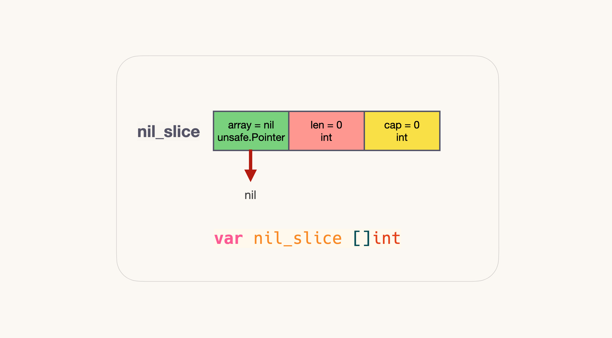
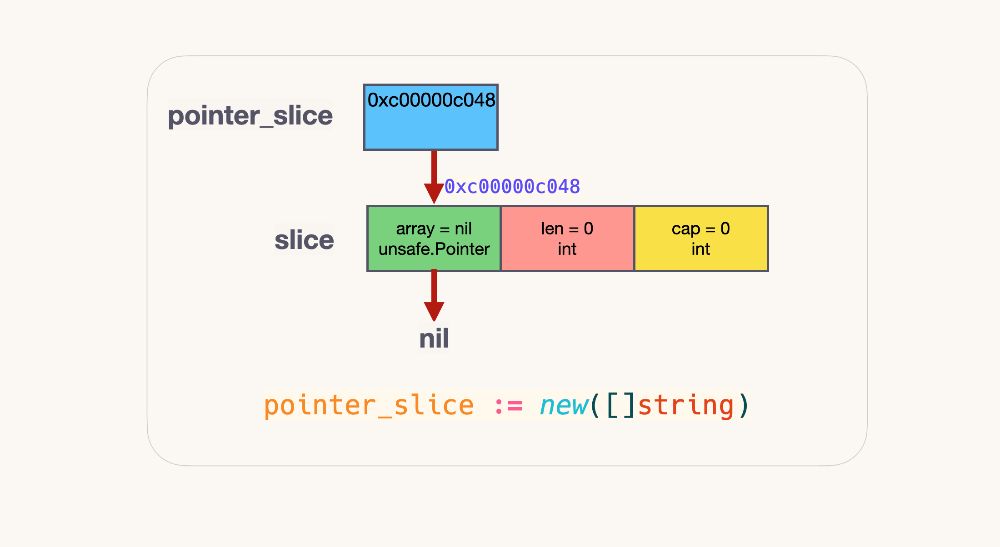
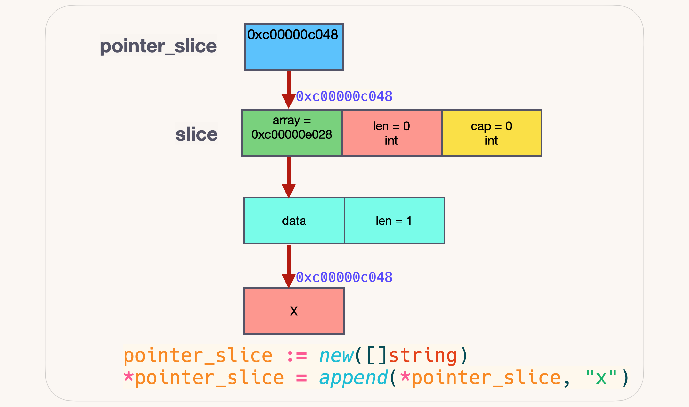
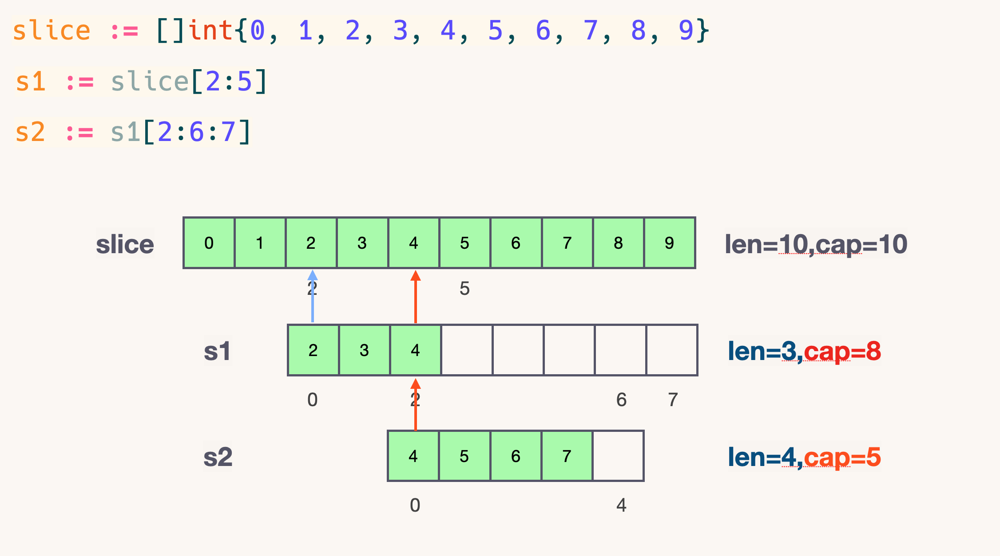
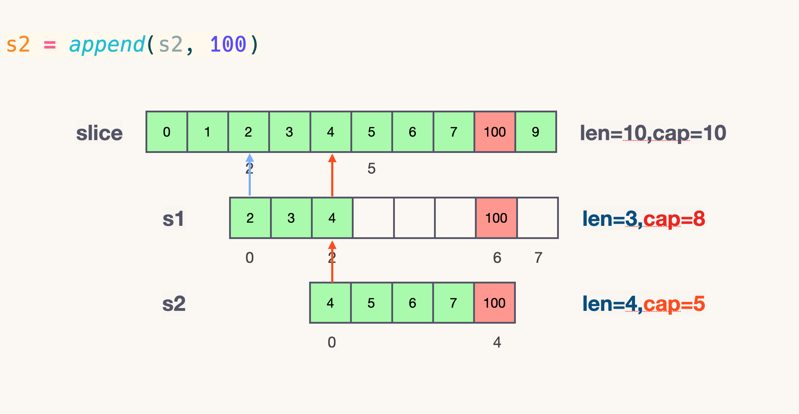
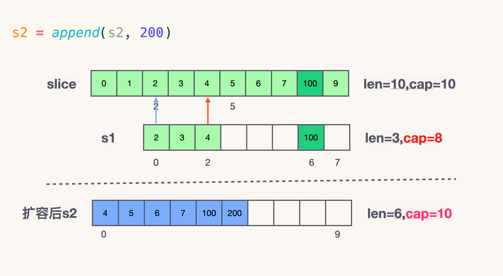
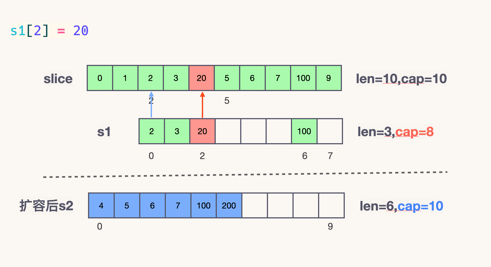

1. [✳ Array 与 Slice 有什么区别？](#-array-与-slice-有什么区别)
1. [✴ Slice 基本数据结构](#-slice-基本数据结构)
1. [✏  创建切片](#--创建切片)
1. [📝  切片扩容](#--切片扩容)
1. [✅  切片拷贝](#--切片拷贝)


##  ✳ Array 与 Slice 有什么区别？


1. **Slice 的底层数据是数组, Slice 是对底层数组进行了封装，它描述一个数组的片段。**
两者都可以通过下标来访问单个元素。

2. **数组是定长的**，长度定义好之后，不能再更改。在 Go 中，数组是不常见的，因为其长度是类型的一部分，限制了它的表达能力，比如 [3]int 和 [4]int 就是不同的类型。
**而切片则非常灵活，它可以动态地扩容。切片的类型和长度无关。**

3. **Array 是值类型**，赋值和函数传参操作都会复制整个数组数据。
**在函数间传递切片就是要在函数间以值的方式传递切片。由于切片的尺寸很小，在函数间复制和传递切片成本也很低。**

4. Array 是一片连续的内存， 而 Slice 实际上是一个结构体，包含三个字段：底层数组、长度、容量。


```go
package main

import "fmt"

func main() {
	Array1 := [5]int{}
	Array2 := [2]int{}
	fmt.Printf("Array1 的数据类型：%T\nArray2 的数据类型：%T\n", Array1, Array2)
}

```

打印结果：

```go
Array1 的数据类型：[5]int
Array2 的数据类型：[2]int
```


```go
package main

import "fmt"

func main() {
	arrayA := [2]int{100, 200}
	var arrayB [2]int

	arrayB = arrayA

	fmt.Printf("arrayA : %p , %v\n", &arrayA, arrayA)
	fmt.Printf("arrayB : %p , %v\n", &arrayB, arrayB)

	testArray(arrayA)
}

func testArray(x [2]int) {
	fmt.Printf("func Array : %p , %v\n", &x, x)
}

```


打印结果：

```go
arrayA : 0xc00012a010 , [100 200]
arrayB : 0xc00012a020 , [100 200]
func Array : 0xc00012a060 , [100 200]
```


## ✴ Slice 基本数据结构


以下代码基于 Go 1.17

 slice 的底层源码和相关实现在 src/runtime/slice.go

```go
type slice struct {
	array unsafe.Pointer
	len   int
	cap   int
}
```


 


## ✏  创建切片


**nil 切片**

```go
	var nil_slice []int
```



**空切片**

```go
	empty_slice := make([]int, 0) 
	empty_slice := []int{}
```


**new切片**

```go
	new_slice := new([]string)
```





## 📝  切片扩容


```go
package main

import "fmt"

func main() {
	slice := []int{0, 1, 2, 3, 4, 5, 6, 7, 8, 9}
	s1 := slice[2:5]
	s2 := s1[2:6:7]
	fmt.Printf("s1: len=%v, cap=%v\n", len(s1), cap(s1))
	fmt.Printf("s2: len=%v, cap=%v\n", len(s2), cap(s2))

	s2 = append(s2, 100)
	s2 = append(s2, 200)
	fmt.Printf("\t扩容后 s2: len=%v, cap=%v\n", len(s2), cap(s2))

	s1[2] = 20

	fmt.Println("slice = ", slice)
	fmt.Println("s1 = ", s1)
	fmt.Println("s2 = ", s2)

}

```

打印结果：

```go
s1: len=3, cap=8
s2: len=4, cap=5
        扩容后 s2: len=6, cap=10
slice =  [0 1 2 3 20 5 6 7 100 9]
s1 =  [2 3 20]
s2 =  [4 5 6 7 100 200]
```

s1 从 slice 索引2（闭区间）到索引5（开区间，元素真正取到索引4），长度为3，容量默认到数组结尾，为8。 s2 从 s1 的索引2（闭区间）到索引6（开区间，元素真正取到索引5），**容量到索引7（开区间，真正到索引6），cap为5**



向 s2 尾部追加一个元素 100：

```go
s2 = append(s2, 100)
```
s2 容量刚好够，直接追加。不过，这会修改原始数组对应位置的元素。这一改动，数组和 s1 都可以看得到。




向 s2 追加元素200：

```go
s2 = append(s2, 200)
```

s2 的容量不够用，该扩容了。于是，s2 另起炉灶，将原来的元素复制新的位置，扩大自己的容量。并且为了应对未来可能的 append 带来的再一次扩容，s2 会在此次扩容的时候多留一些 buffer，将新的容量将扩大为原始容量的2倍，也就是10了。



最后，修改 s1 索引为2位置的元素：

```go
s1[2] = 20
```

这次只会影响原始数组相应位置的元素。它影响不到 s2 。



打印 s1 的时候，只会打印出 s1 长度以内的元素。所以，只会打印出3个元素，虽然它的底层数组不止3个元素。


## ✅  切片拷贝


Reference：
《Go in action》
《Go 语言学习笔记》