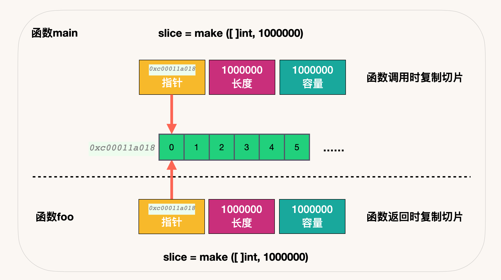

1. [Array 与 Slice 有什么区别？](#array-与-slice-有什么区别)
1. [Slice 基本数据结构](#slice-基本数据结构)
1. [创建切片](#创建切片)
1. [切片扩容](#切片扩容)
1. [切片拷贝](#切片拷贝)
1. [在函数间传递切片](#在函数间传递切片)
1. [练习](#练习)


##  Array 与 Slice 有什么区别？


1. **Slice 的底层数据是数组, Slice 是对底层数组进行了封装，它描述一个数组的片段。**
两者都可以通过下标来访问单个元素。

2. **数组是定长的**，长度定义好之后，不能再更改。在 Go 中，数组是不常见的，因为其长度是类型的一部分，限制了它的表达能力，比如 [3]int 和 [4]int 就是不同的类型。
**而切片则非常灵活，它可以动态地扩容。切片的类型和长度无关。**

3.  Array 是一片连续的内存， 而 Slice 实际上是一个结构体，包含三个字段：底层数组、长度、容量。


**Array 是值类型**，赋值和函数传参操作都会复制整个数组数据。

**Slice 在函数间传递切片就是要在函数间以值的方式传递切片。由于切片的尺寸很小，在函数间复制和传递切片成本也很低。**


```go
package main

import "fmt"

func main() {
	Array1 := [5]int{}
	Array2 := [2]int{}
	fmt.Printf("Array1 的数据类型：%T\nArray2 的数据类型：%T\n", Array1, Array2)
}

```

打印结果：

```go
Array1 的数据类型：[5]int
Array2 的数据类型：[2]int
```


```go
package main

import "fmt"

func main() {
	arrayA := [2]int{100, 200}
	var arrayB [2]int

	arrayB = arrayA

	fmt.Printf("arrayA : %p , %v\n", &arrayA, arrayA)
	fmt.Printf("arrayB : %p , %v\n", &arrayB, arrayB)

	testArray(arrayA)
}

func testArray(x [2]int) {
	fmt.Printf("func Array : %p , %v\n", &x, x)
}

```


打印结果：

```go
arrayA : 0xc00012a010 , [100 200]
arrayB : 0xc00012a020 , [100 200]
func Array : 0xc00012a060 , [100 200]
```


## Slice 基本数据结构


以下代码基于 Go 1.17

 slice 的底层源码和相关实现在 src/runtime/slice.go

```go
type slice struct {
	array unsafe.Pointer
	len   int
	cap   int
}
```


 


## 创建切片


**nil 切片**


```go
	var nil_slice []int
```


nil 切片被用在很多标准库和内置函数中，描述一个不存在的切片的时候，就需要用到 nil 切片。比如函数在发生异常的时候，返回的切片就是 nil 切片。nil 切片的指针指向 nil。


**空切片**

```go
	empty_slice := make([]int, 0) 
	empty_slice := []int{}
```


空切片一般会用来表示一个空的集合。比如数据库查询，一条结果也没有查到，那么就可以返回一个空切片。

**指针切片**

```go
	pointer_slice := new([]string)
```


## 切片扩容


当一个切片的容量满了，就需要扩容了。怎么扩，策略是什么？

**在分配内存空间之前需要先确定新的切片容量，运行时根据切片的当前容量选择不同的策略进行扩容：**

1. 如果期望容量大于当前容量的两倍就会使用期望容量；
2. 如果当前切片的长度小于 1024 就会将容量翻倍；
3. 如果当前切片的长度大于 1024 就会每次增加 25% 的容量，直到新容量大于期望容量；

**Go 中切片扩容的策略是这样的：**

1. 首先判断，如果新申请容量（cap）大于2倍的旧容量（old.cap），最终容量（newcap）就是新申请的容量（cap）
2. 否则判断，如果旧切片的长度小于1024，则最终容量(newcap)就是旧容量(old.cap)的两倍，即（newcap=doublecap）
3. 否则判断，如果旧切片长度大于等于1024，则最终容量（newcap）从旧容量（old.cap）开始循环增加原来的 1/4，即（newcap=old.cap,for {newcap += newcap/4}）直到最终容量（newcap）大于等于新申请的容量(cap)，即（newcap >= cap）
4. 如果最终容量（cap）计算值溢出，则最终容量（cap）就是新申请容量（cap）

注意：扩容扩大的容量都是针对原来的容量而言的，而不是针对原来数组的长度而言的。

**以下代码基于 Go 1.17** src/runtime/slice.go 

```go
func growslice(et *_type, old slice, cap int) slice {
	if raceenabled {
		callerpc := getcallerpc()
		racereadrangepc(old.array, uintptr(old.len*int(et.size)), callerpc, funcPC(growslice))
	}
	if msanenabled {
		msanread(old.array, uintptr(old.len*int(et.size)))
	}

	if cap < old.cap {
		panic(errorString("growslice: cap out of range"))
	}

	if et.size == 0 {
		// append should not create a slice with nil pointer but non-zero len.
		// We assume that append doesn't need to preserve old.array in this case.
		return slice{unsafe.Pointer(&zerobase), old.len, cap}
	}

	newcap := old.cap
	doublecap := newcap + newcap
	if cap > doublecap {
		newcap = cap
	} else {
		if old.cap < 1024 {
			newcap = doublecap
		} else {
			// Check 0 < newcap to detect overflow
			// and prevent an infinite loop.
			for 0 < newcap && newcap < cap {
				newcap += newcap / 4
			}
			// Set newcap to the requested cap when
			// the newcap calculation overflowed.
			if newcap <= 0 {
				newcap = cap
			}
		}
	}

	var overflow bool
	var lenmem, newlenmem, capmem uintptr
	// Specialize for common values of et.size.
	// For 1 we don't need any division/multiplication.
	// For sys.PtrSize, compiler will optimize division/multiplication into a shift by a constant.
	// For powers of 2, use a variable shift.
	switch {
	case et.size == 1:
		lenmem = uintptr(old.len)
		newlenmem = uintptr(cap)
		capmem = roundupsize(uintptr(newcap))
		overflow = uintptr(newcap) > maxAlloc
		newcap = int(capmem)
	case et.size == sys.PtrSize:
		lenmem = uintptr(old.len) * sys.PtrSize
		newlenmem = uintptr(cap) * sys.PtrSize
		capmem = roundupsize(uintptr(newcap) * sys.PtrSize)
		overflow = uintptr(newcap) > maxAlloc/sys.PtrSize
		newcap = int(capmem / sys.PtrSize)
	case isPowerOfTwo(et.size):
		var shift uintptr
		if sys.PtrSize == 8 {
			// Mask shift for better code generation.
			shift = uintptr(sys.Ctz64(uint64(et.size))) & 63
		} else {
			shift = uintptr(sys.Ctz32(uint32(et.size))) & 31
		}
		lenmem = uintptr(old.len) << shift
		newlenmem = uintptr(cap) << shift
		capmem = roundupsize(uintptr(newcap) << shift)
		overflow = uintptr(newcap) > (maxAlloc >> shift)
		newcap = int(capmem >> shift)
	default:
		lenmem = uintptr(old.len) * et.size
		newlenmem = uintptr(cap) * et.size
		capmem, overflow = math.MulUintptr(et.size, uintptr(newcap))
		capmem = roundupsize(capmem)
		newcap = int(capmem / et.size)
	}

	// The check of overflow in addition to capmem > maxAlloc is needed
	// to prevent an overflow which can be used to trigger a segfault
	// on 32bit architectures with this example program:
	//
	// type T [1<<27 + 1]int64
	//
	// var d T
	// var s []T
	//
	// func main() {
	//   s = append(s, d, d, d, d)
	//   print(len(s), "\n")
	// }
	if overflow || capmem > maxAlloc {
		panic(errorString("growslice: cap out of range"))
	}

	var p unsafe.Pointer
	if et.ptrdata == 0 {
		p = mallocgc(capmem, nil, false)
		// The append() that calls growslice is going to overwrite from old.len to cap (which will be the new length).
		// Only clear the part that will not be overwritten.
		memclrNoHeapPointers(add(p, newlenmem), capmem-newlenmem)
	} else {
		// Note: can't use rawmem (which avoids zeroing of memory), because then GC can scan uninitialized memory.
		p = mallocgc(capmem, et, true)
		if lenmem > 0 && writeBarrier.enabled {
			// Only shade the pointers in old.array since we know the destination slice p
			// only contains nil pointers because it has been cleared during alloc.
			bulkBarrierPreWriteSrcOnly(uintptr(p), uintptr(old.array), lenmem-et.size+et.ptrdata)
		}
	}
	memmove(p, old.array, lenmem)

	return slice{p, old.len, newcap}
}
```


**练习1：**

```go
package main

import "fmt"

func main() {
	slice := []int{1, 2}
	slice = append(slice, 3, 4, 5)
	fmt.Printf("len = %d, cap = %d\n", len(slice), cap(slice))
}

```

打印结果：

```go
len = 5, cap = 6
```

```go
// src/runtime/msize.go
// Returns size of the memory block that mallocgc will allocate if you ask for the size.
func roundupsize(size uintptr) uintptr {
	if size < _MaxSmallSize {
		if size <= smallSizeMax-8 {
			return uintptr(class_to_size[size_to_class8[divRoundUp(size, smallSizeDiv)]])
		} else {
			return uintptr(class_to_size[size_to_class128[divRoundUp(size-smallSizeMax, largeSizeDiv)]])
		}
	}
	if size+_PageSize < size {
		return size
	}
	return alignUp(size, _PageSize)
}
```

```go
const (
	_MaxSmallSize   = 32768
	smallSizeDiv    = 8
	smallSizeMax    = 1024
	largeSizeDiv    = 128
	_NumSizeClasses = 68
	_PageShift      = 13
)

```


## 切片拷贝

```go
// slicecopy is used to copy from a string or slice of pointerless elements into a slice.
func slicecopy(toPtr unsafe.Pointer, toLen int, fromPtr unsafe.Pointer, fromLen int, width uintptr) int {
	if fromLen == 0 || toLen == 0 {
		return 0
	}

	n := fromLen
	if toLen < n {
		n = toLen
	}

	if width == 0 {
		return n
	}

	size := uintptr(n) * width
	if raceenabled {
		callerpc := getcallerpc()
		pc := funcPC(slicecopy)
		racereadrangepc(fromPtr, size, callerpc, pc)
		racewriterangepc(toPtr, size, callerpc, pc)
	}
	if msanenabled {
		msanread(fromPtr, size)
		msanwrite(toPtr, size)
	}

	if size == 1 { // common case worth about 2x to do here
		// TODO: is this still worth it with new memmove impl?
		*(*byte)(toPtr) = *(*byte)(fromPtr) // known to be a byte pointer
	} else {
		memmove(toPtr, fromPtr, size)
	}
	return n
}
```


## 在函数间传递切片

在函数间传递切片就是要在 **函数间以值的方式传递切片。** 由于切片的尺寸很小，在函数间复制和传递切片成本也很低。

让我们创建一个大切片，并将这个切片以值的方式传递给函数 foo。

**在函数间传递切片：**
```go
package main

import "fmt"

func main() {
	slice := make([]int, 1e6)
	fmt.Printf("slice pointer = %p\n", &slice)
	slice = foo(slice)
	fmt.Printf("slice pointer = %p\n", &slice)
}
func foo(slice []int)[]int{
	return slice
}
```

打印结果：
```go
slice pointer = 0xc00011a018
slice pointer = 0xc00011a018

```

在 64 位架构的机器上，一个切片需要 24 字节的内存：指针字段需要 8 字节，长度和容量
字段分别需要 8 字节。由于与切片关联的数据包含在底层数组里，不属于切片本身，所以将切片
复制到任意函数的时候，对底层数组大小都不会有影响。复制时只会复制切片本身，不会涉及底
层数组。




在函数间传递 24 字节的数据会非常快速、简单。这也是切片效率高的地方。不需要传递指
针和处理复杂的语法，只需要复制切片，按想要的方式修改数据，然后传递回一份新的切片副本。


## 练习

```go
package main

import "fmt"

func main() {
	slice := []int{0, 1, 2, 3, 4, 5, 6, 7, 8, 9}
	s1 := slice[2:5]
	s2 := s1[2:6:7]
	fmt.Printf("s1: len=%v, cap=%v\n", len(s1), cap(s1))
	fmt.Printf("s2: len=%v, cap=%v\n", len(s2), cap(s2))

	s2 = append(s2, 100)
	s2 = append(s2, 200)
	fmt.Printf("\t扩容后 s2: len=%v, cap=%v\n", len(s2), cap(s2))

	s1[2] = 20

	fmt.Println("slice = ", slice)
	fmt.Println("s1 = ", s1)
	fmt.Println("s2 = ", s2)

}

```

打印结果：

```go
s1: len=3, cap=8
s2: len=4, cap=5
        扩容后 s2: len=6, cap=10
slice =  [0 1 2 3 20 5 6 7 100 9]
s1 =  [2 3 20]
s2 =  [4 5 6 7 100 200]
```

s1 从 slice 索引2（闭区间）到索引5（开区间，元素真正取到索引4），长度为3，容量默认到数组结尾，为8。 s2 从 s1 的索引2（闭区间）到索引6（开区间，元素真正取到索引5），**容量到索引7（开区间，真正到索引6），cap为5**


向 s2 尾部追加一个元素 100：

```go
s2 = append(s2, 100)
```
s2 容量刚好够，直接追加。不过，这会修改原始数组对应位置的元素。这一改动，数组和 s1 都可以看得到。


向 s2 追加元素200：

```go
s2 = append(s2, 200)
```

s2 的容量不够用，该扩容了。于是，s2 另起炉灶，将原来的元素复制新的位置，扩大自己的容量。并且为了应对未来可能的 append 带来的再一次扩容，s2 会在此次扩容的时候多留一些 buffer，将新的容量将扩大为原始容量的2倍，也就是10了。


最后，修改 s1 索引为2位置的元素：

```go
s1[2] = 20
```

这次只会影响原始数组相应位置的元素。它影响不到 s2 。


打印 s1 的时候，只会打印出 s1 长度以内的元素。所以，只会打印出3个元素，虽然它的底层数组不止3个元素。


Reference：
《Go in action》
《Go 语言学习笔记》