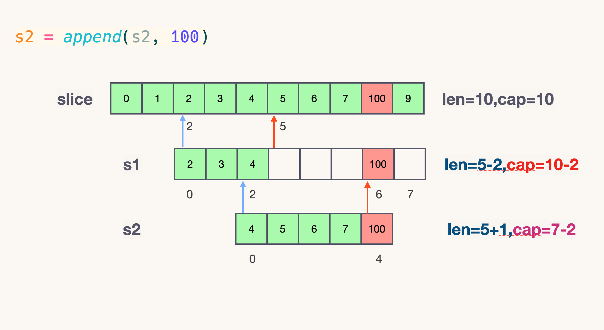

1. [数组和切片有什么异同?](#数组和切片有什么异同)
2. [切片作为函数参数?](#切片作为函数参数)
3. [切片的容量是怎样增长的?](#切片的容量是怎样增长的)
4. [nil 和 空切片的区别？](#nil-和-空切片的区别)
5. [指针切片](#指针切片)


## 数组和切片有什么异同?

切片是一个很小的对象，对底层数组进行了抽象，并提供相关的操作方法。切片有 3 个字段的数据结构，这些数据结构包含 Go 语言需要操作底层数组的元数据：**(底层数组)地址指针，长度，容量**。

slice 的底层数据是数组，slice 是对数组的封装，它描述一个数组的片段。两者都可以通过下标来访问单个元素。
数组是定长的，长度定义好之后，不能再更改。在 Go 中，数组是不常见的，因为其长度是类型的一部分，限制了它的表达能力，比如 [3]int 和 [4]int 就是不同的类型。
而切片则非常灵活，它可以动态地扩容。切片的类型和长度无关。
数组就是一片连续的内存， slice 实际上是一个结构体，包含三个字段：长度、容量、底层数组。


/usr/local/go/src/runtime/slice.go

```go
type slice struct {
	array unsafe.Pointer
	len   int
	cap   int
}
```


1. 数组


数组变量的类型包括数组长度和每个元素的类型。

在 Go 中，与 C 数组变量隐式作为指针使用不同，Go 数组是值类型，赋值和函数传参操作都会复制整个数组数据。

不过传指针会有一个弊端，指针地址都是同一个，万一原数组的指针指向更改了，那么函数里面的指针指向都会跟着更改。

1. 切片


切片的优势也就表现出来了。用切片传数组参数，既可以达到节约内存的目的，也可以达到合理处理好共享内存的问题。

由此我们可以得出结论：把第一个大数组传递给函数会消耗很多内存，采用切片的方式传参可以避免上述问题。切片是引用传递，所以它们不需要使用额外的内存并且比使用数组更有效率。

但是，依旧有反例。
并非所有时候都适合用切片代替数组，因为切片底层数组可能会在堆上分配内存，而且小数组在栈上拷贝的消耗也未必比 make 消耗大。


切片本身并不是动态数组或者数组指针。它内部实现的数据结构通过指针引用底层数组，设定相关属性将数据读写操作限定在指定的区域内。**切片本身是一个只读对象，其工作机制类似数组指针的一种封装。**

切片（slice）是对数组一个连续片段的引用，所以切片是一个引用类型


```go
package main

import "fmt"

func main() {
    slice := []int{0, 1, 2, 3, 4, 5, 6, 7, 8, 9}
    s1 := slice[2:5]
    s2 := s1[2:6:7]	// slice[start:end:cap] 
    s2 = append(s2, 100)
    s2 = append(s2, 200)

    s1[2] = 20

    fmt.Println(s1)
    fmt.Println(s2)
    fmt.Println(slice)
}

```
程序输出：
```go
[2 3 20]
[4 5 6 7 100 200]
[0 1 2 3 20 5 6 7 100 9]
```

对底层数组容量是 k 的切片 slice[i:j] 来说 
- 长度: j - i
- 容量: k - i





再提一点，打印 s1 的时候，只会打印出 s1 长度以内的元素。所以，只会打印出3个元素，虽然它的底层数组不止3个元素。


## 切片作为函数参数?


## 切片的容量是怎样增长的?


切片的动态增长是通过内置函数 append 来实现的。这个函数可以快速且高效地增长切片。还可以通过对切片再次切片来缩小一个切片的大小。因为切片的底层内存也是在连续块中分配的，所以切片还能获得索引、迭代以及为垃圾回收优化的好处。

切片是一个很小的对象，对底层数组进行了抽象，并提供相关的操作方法。


```go
slice := array[1:2:3]
```
**上面这种情况非常危险，极度容易产生 bug 。**

建议用字面量创建切片的时候，cap 的值一定要保持清醒，避免共享原数组导致的 bug。

之所以生成了新的切片，是因为原来数组的容量已经达到了最大值，再想扩容， Go 默认会先开一片内存区域，把原来的值拷贝过来，然后再执行 append() 操作。这种情况丝毫不影响原数组。避免 bug 产生。


```go
func growslice(et *_type, old slice, cap int) slice {
	newcap := old.cap
	doublecap := newcap + newcap
	if cap > doublecap {
		newcap = cap
	} else {
		const threshold = 256
		if old.cap < threshold {
			newcap = doublecap
		} else {
			// Check 0 < newcap to detect overflow
			// and prevent an infinite loop.
			for 0 < newcap && newcap < cap {
				// Transition from growing 2x for small slices
				// to growing 1.25x for large slices. This formula
				// gives a smooth-ish transition between the two.
				newcap += (newcap + 3*threshold) / 4
			}
			// Set newcap to the requested cap when
			// the newcap calculation overflowed.
			if newcap <= 0 {
				newcap = cap
			}
		}
	}
```


## nil 和 空切片的区别？

```go
var nil_slice []int
```


nil 切片被用在很多标准库和内置函数中，描述一个不存在的切片的时候，就需要用到 nil 切片。比如函数在发生异常的时候，返回的切片就是 nil 切片。nil 切片的指针指向 nil。


```go
empty_slice := make([]int, 0) 
empty_slice := []int{}
```


空切片一般会用来表示一个空的集合。比如数据库查询，一条结果也没有查到，那么就可以返回一个空切片。

空切片和 nil 切片的区别在于，空切片指向的地址不是nil，指向的是一个内存地址，但是它没有分配任何内存空间，即底层元素包含0个元素。

最后需要说明的一点是。不管是使用 nil 切片还是空切片，对其调用内置函数 append，len 和 cap 的效果都是一样的。


```go

// slicecopy is used to copy from a string or slice of pointerless elements into a slice.
func slicecopy(toPtr unsafe.Pointer, toLen int, fromPtr unsafe.Pointer, fromLen int, width uintptr) int {
    // 如果源切片或者目标切片有一个长度为0，那么就不需要拷贝，直接 return 
	if fromLen == 0 || toLen == 0 {
		return 0
	}
    // n 记录下源切片或者目标切片较短的那一个的长度
	n := fromLen
	if toLen < n {
		n = toLen
	}
    // 如果入参 width = 0，也不需要拷贝了，返回较短的切片的长度
	if width == 0 {
		return n
	}
    // 如果开启了竞争检测
	size := uintptr(n) * width
	if raceenabled {
		callerpc := getcallerpc()
		pc := abi.FuncPCABIInternal(slicecopy)
		racereadrangepc(fromPtr, size, callerpc, pc)
		racewriterangepc(toPtr, size, callerpc, pc)
	}
    // 如果开启了 The memory sanitizer (msan)
	if msanenabled {
		msanread(fromPtr, size)
		msanwrite(toPtr, size)
	}
	if asanenabled {
		asanread(fromPtr, size)
		asanwrite(toPtr, size)
	}
	if size == 1 { // common case worth about 2x to do here
		// TODO: is this still worth it with new memmove impl?
        // 如果只有一个元素，那么指针直接转换即可
		*(*byte)(toPtr) = *(*byte)(fromPtr) // known to be a byte pointer
	} else {
        // 如果不止一个元素，那么就把 size 个 bytes 从 fm.array 地址开始，拷贝到 to.array 地址之后
		memmove(toPtr, fromPtr, size)
	}
	return n
}

```


**for range**

```go
package main

import "fmt"

func main() {
	slice := []int{10, 20, 30, 40}
	for index, value := range slice {
		fmt.Printf("value = %d , value-addr = %x , slice-addr = %x\n", value, &value, &slice[index])
	}
}
```
程序输出：

```go
➜  demo git:(main) ✗ go run main.go
value = 10 , value-addr = c0000b2008 , slice-addr = c0000b4000
value = 20 , value-addr = c0000b2008 , slice-addr = c0000b4008
value = 30 , value-addr = c0000b2008 , slice-addr = c0000b4010
value = 40 , value-addr = c0000b2008 , slice-addr = c0000b4018
```
从上面结果我们可以看到，如果用 range 的方式去遍历一个切片，拿到的 Value 其实是切片里面的值拷贝。所以每次打印 Value 的地址都不变。

由于 Value 是值拷贝的，并非引用传递，所以直接改 Value 是达不到更改原切片值的目的的，需要通过 &slice[index] 获取真实的地址。


## 指针切片


参考链接：

[](https://halfrost.com/go_slice/)

[](https://qcrao91.gitbook.io/go/shu-zu-he-qie-pian/shu-zu-he-qie-pian-you-shi-mo-yi-tong)