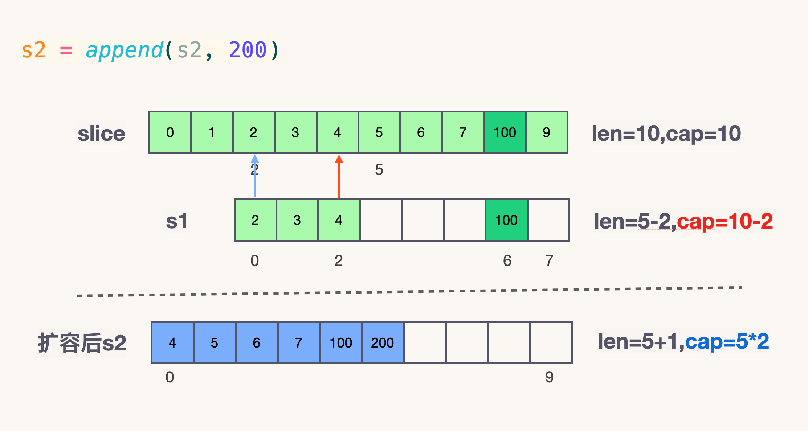

1. [数组和切片有什么异同?](#数组和切片有什么异同)
2. [切片作为函数参数?](#切片作为函数参数)
3. [切片的容量是怎样增长的?](#切片的容量是怎样增长的)
4. [nil 和 空切片的区别？](#nil-和-空切片的区别)
5. [指针切片](#指针切片)
6. [向一个nil的slice添加元素会发生什么？为什么？](#向一个nil的slice添加元素会发生什么为什么)


**总结：**

- 每个切片都指向一个底层数组
- 每个切片都保存了当前切片的长度、底层数组可用容量
- 使用len()计算切片长度时间复杂度为O(1)，不需要遍历切片
- 使用cap()计算切片容量时间复杂度为O(1)，不需要遍历切片
- 通过函数传递切片时，不会拷贝整个切片，因为切片本身只是个结构体而矣
- 使用append()向切片追加元素时有可能触发扩容，扩容后将会生成新的切片


## 数组和切片有什么异同?

切片是一个很小的对象，对底层数组进行了抽象，并提供相关的操作方法。切片有 3 个字段的数据结构，这些数据结构包含 Go 语言需要操作底层数组的元数据：**(底层数组)地址指针，长度，容量**。

slice 的底层数据是数组，slice 是对数组的封装，它描述一个数组的片段。两者都可以通过下标来访问单个元素。
数组是定长的，长度定义好之后，不能再更改。在 Go 中，数组是不常见的，因为其长度是类型的一部分，限制了它的表达能力，比如 [3]int 和 [4]int 就是不同的类型。
而切片则非常灵活，它可以动态地扩容。切片的类型和长度无关。
数组就是一片连续的内存， slice 实际上是一个结构体，包含三个字段：长度、容量、底层数组。


/usr/local/go/src/runtime/slice.go

```go
type slice struct {
	array unsafe.Pointer
	len   int
	cap   int
}
```


1. 数组


数组变量的类型包括数组长度和每个元素的类型。

在 Go 中，与 C 数组变量隐式作为指针使用不同，Go 数组是值类型，赋值和函数传参操作都会复制整个数组数据。

不过传指针会有一个弊端，指针地址都是同一个，万一原数组的指针指向更改了，那么函数里面的指针指向都会跟着更改。

1. 切片


切片的优势也就表现出来了。用切片传数组参数，既可以达到节约内存的目的，也可以达到合理处理好共享内存的问题。

由此我们可以得出结论：把第一个大数组传递给函数会消耗很多内存，采用切片的方式传参可以避免上述问题。切片是引用传递，所以它们不需要使用额外的内存并且比使用数组更有效率。

但是，依旧有反例。
并非所有时候都适合用切片代替数组，因为切片底层数组可能会在堆上分配内存，而且小数组在栈上拷贝的消耗也未必比 make 消耗大。


切片本身并不是动态数组或者数组指针。它内部实现的数据结构通过指针引用底层数组，设定相关属性将数据读写操作限定在指定的区域内。**切片本身是一个只读对象，其工作机制类似数组指针的一种封装。**

切片（slice）是对数组一个连续片段的引用，所以切片是一个引用类型

两个切片共享同一个底层数组。如果一个切片修改了该底层数组的共享 部分，另一个切片也能感知到。


```go
package main

import "fmt"

func main() {
    slice := []int{0, 1, 2, 3, 4, 5, 6, 7, 8, 9}
    s1 := slice[2:5]
    s2 := s1[2:6:7]	// slice[start:end:cap] 
    s2 = append(s2, 100)
    s2 = append(s2, 200)

    s1[2] = 20

    fmt.Println(s1)
    fmt.Println(s2)
    fmt.Println(slice)
}

```
程序输出：
```go
[2 3 20]
[4 5 6 7 100 200]
[0 1 2 3 20 5 6 7 100 9]
```

对底层数组容量是 k 的切片 slice[i:j] 来说 
- 长度: j - i
- 容量: k - i




再提一点，打印 s1 的时候，只会打印出 s1 长度以内的元素。所以，只会打印出3个元素，虽然它的底层数组不止3个元素。


## 切片作为函数参数?


在函数间传递切片就是要在函数间以值的方式传递切片。由于切片的尺寸很小，在函数间复 制和传递切片成本也很低。


```go
package main

import "fmt"

func main() {
	// 分配包含 100 万个整型值的切片
	slice := make([]int, 1e6)
	fmt.Printf("slice pointer = %p\n", &slice)
	// 将 slice 传递到函数 foo
	slice = foo(slice)
	fmt.Printf("slice pointer = %p\n", &slice)
}

// 函数 foo 接收一个整型切片，并返回这个切片
func foo(slice []int) []int {
	return slice
}
```

程序输出：
```go
slice pointer = 0xc0000a4018
slice pointer = 0xc0000a4018
```

在 64 位架构的机器上，一个切片需要 24 字节的内存:指针字段需要 8 字节，长度和容量字段分别需要 8 字节。由于与切片关联的数据包含在底层数组里，不属于切片本身，所以将切片复制到任意函数的时候，对底层数组大小都不会有影响。复制时只会复制切片本身，不会涉及底层数组。


在函数间传递 24 字节的数据会非常快速、简单。这也是切片效率高的地方。不需要传递指
针和处理复杂的语法，只需要复制切片，按想要的方式修改数据，然后传递回一份新的切片副本。


**在函数间传递映射**

在函数间传递映射并不会制造出该映射的一个副本。实际上，当传递映射给一个函数，并对 这个映射做了修改时，所有对这个映射的引用都会察觉到这个修改。
这个特性和切片类似，保证可以用很小的成本来复制映射。

将切片或者映射传递给函数成本很小，并且不会复制底层的数据结构。


## 切片的容量是怎样增长的?


- 函数 append 会智能地处理底层数组的容量增长。
- 在切片的容量小于 256 个元素时，总是会成倍地增加容量。
- 一旦元素个数超过 256，容量的增长因子会设为 1.25，也就是会每次增加 25% 的容量。

```go
func growslice(et *_type, old slice, cap int) slice {
	newcap := old.cap
	doublecap := newcap + newcap
	// 如果期望容量大于当前容量的两倍就会使用期望容量
	if cap > doublecap {
		newcap = cap
	} else {
		const threshold = 256
		// 如果当前切片的长度小于阈值 256 就会将容量翻倍；
		if old.cap < threshold {
			newcap = doublecap
		} else {
			// 检查 0 < newcap 探测溢出，并预防或阻止无限循环
			for 0 < newcap && newcap < cap {
				// 小切片以2倍速增长，大切片以1.25倍速增长，这个公式给出了两者的平滑转变。
				newcap += (newcap + 3*threshold) / 4
			}
			// 当newcap计算溢出的时候，设置newcap 为被请求的/期望 cap
			if newcap <= 0 {
				newcap = cap
			}
		}
	}

```

1. 如果期望容量大于当前容量的两倍就会使用期望容量；
2. 如果当前切片的长度小于阈值 256 就会将容量翻倍；
3. 如果当前切片的长度大于阈值 256 就会每次增加 25% 的容量，直到新容量大于期望容量；


切片的动态增长是通过内置函数 append 来实现的。这个函数可以快速且高效地增长切片。还可以通过对切片再次切片来缩小一个切片的大小。因为切片的底层内存也是在连续块中分配的，所以切片还能获得索引、迭代以及为垃圾回收优化的好处。

切片是一个很小的对象，对底层数组进行了抽象，并提供相关的操作方法。


```go
slice := array[1:2:3]
```
**上面这种情况非常危险，极度容易产生 bug 。**

建议用字面量创建切片的时候，cap 的值一定要保持清醒，避免共享原数组导致的 bug。

之所以生成了新的切片，是因为原来数组的容量已经达到了最大值，再想扩容， Go 默认会先开一片内存区域，把原来的值拷贝过来，然后再执行 append() 操作。这种情况丝毫不影响原数组。避免 bug 产生。


内置函数 append 会首先使用可用容量。一旦没有可用容量，会分配一个 新的底层数组。这导致很容易忘记切片间正在共享同一个底层数组。一旦发生这种情况，对切片 进行修改，很可能会导致随机且奇怪的问题。对切片内容的修改会影响多个切片，却很难找到问 题的原因。
如果在创建切片时设置切片的容量和长度一样，就可以强制让新切片的第一个 append 操作 创建新的底层数组，与原有的底层数组分离。

**设置长度和容量一样的好处**

```go
// 创建字符串切片
// 其长度和容量都是 5 个元素
source := []string{"Apple", "Orange", "Plum", "Banana", "Grape"}
// 对第三个元素做切片，并限制容量 // 其长度和容量都是 1 个元素 
slice := source[2:3:3]
// 向 slice 追加新字符串
slice = append(slice, "Kiwi")
```

程序输出：
```go
slice=[Plum], slice_addr=0xc00011a000, len=1, cap=1
newSlice=[Plum Kiwi], newSlice_addr=0xc00011a030, len=2, cap=2
```

如果不加第三个索引，由于剩余的所有容量都属于 slice，向 slice 追加 Kiwi 会改变 原有底层数组索引为 3 的元素的值 Banana。不过在代码清单 4-36 中我们限制了 slice 的容 量为 1。当我们第一次对 slice 调用 append 的时候，会创建一个新的底层数组，这个数组包 括 2 个元素，并将水果 Plum 复制进来，再追加新水果 Kiwi，并返回一个引用了这个底层数组 的新切片，如图 4-18 所示。
因为新的切片 slice 拥有了自己的底层数组，所以杜绝了可能发生的问题。我们可以继续 向新切片里追加水果，而不用担心会不小心修改了其他切片里的水果。同时，也保持了为切片申请新的底层数组的简洁。


内置函数 append 也是一个可变参数的函数。这意味着可以在一次调用传递多个追加的值。
如果使用...运算符，可以将一个切片的所有元素追加到另一个切片里

```go
	// 创建两个切片，并分别用两个整数进行初始化
	s1 := []int{1, 2}
	s2 := []int{3, 4}
	// 将两个切片追加在一起，并显示结果
	fmt.Printf("%v\n", append(s1, s2...)) // [1 2 3 4]
```


## nil 和 空切片的区别？

```go
var nil_slice []int
```


nil 切片被用在很多标准库和内置函数中，描述一个不存在的切片的时候，就需要用到 nil 切片。比如函数在发生异常的时候，返回的切片就是 nil 切片。nil 切片的指针指向 nil。


```go
empty_slice := make([]int, 0) 
empty_slice := []int{}
```


空切片一般会用来表示一个空的集合。比如数据库查询，一条结果也没有查到，那么就可以返回一个空切片。

空切片和 nil 切片的区别在于，空切片指向的地址不是nil，指向的是一个内存地址，但是它没有分配任何内存空间，即底层元素包含0个元素。

最后需要说明的一点是。不管是使用 nil 切片还是空切片，对其调用内置函数 append，len 和 cap 的效果都是一样的。


```go

// slicecopy is used to copy from a string or slice of pointerless elements into a slice.
func slicecopy(toPtr unsafe.Pointer, toLen int, fromPtr unsafe.Pointer, fromLen int, width uintptr) int {
    // 如果源切片或者目标切片有一个长度为0，那么就不需要拷贝，直接 return 
	if fromLen == 0 || toLen == 0 {
		return 0
	}
    // n 记录下源切片或者目标切片较短的那一个的长度
	n := fromLen
	if toLen < n {
		n = toLen
	}
    // 如果入参 width = 0，也不需要拷贝了，返回较短的切片的长度
	if width == 0 {
		return n
	}
    // 如果开启了竞争检测
	size := uintptr(n) * width
	if raceenabled {
		callerpc := getcallerpc()
		pc := abi.FuncPCABIInternal(slicecopy)
		racereadrangepc(fromPtr, size, callerpc, pc)
		racewriterangepc(toPtr, size, callerpc, pc)
	}
    // 如果开启了 The memory sanitizer (msan)
	if msanenabled {
		msanread(fromPtr, size)
		msanwrite(toPtr, size)
	}
	if asanenabled {
		asanread(fromPtr, size)
		asanwrite(toPtr, size)
	}
	if size == 1 { // common case worth about 2x to do here
		// TODO: is this still worth it with new memmove impl?
        // 如果只有一个元素，那么指针直接转换即可
		*(*byte)(toPtr) = *(*byte)(fromPtr) // known to be a byte pointer
	} else {
        // 如果不止一个元素，那么就把 size 个 bytes 从 fm.array 地址开始，拷贝到 to.array 地址之后
		memmove(toPtr, fromPtr, size)
	}
	return n
}

```


**for range**

```go
package main

import "fmt"

func main() {
	slice := []int{10, 20, 30, 40}
	for index, copy_value := range slice {
		fmt.Printf("Value = %d , Value-Addr = %x , Elem-Addr = %x\n", copy_value, &copy_value, &slice[index])
	}
}

```
程序输出：

```go
Value = 10 , Value-Addr = c0000b2008 , Elem-Addr = c0000b6000
Value = 20 , Value-Addr = c0000b2008 , Elem-Addr = c0000b6008
Value = 30 , Value-Addr = c0000b2008 , Elem-Addr = c0000b6010
Value = 40 , Value-Addr = c0000b2008 , Elem-Addr = c0000b6018
```

当迭代切片时，关键字 range 会返回两个值。第一个值是当前迭代到的索引位置，第二个 值是该位置对应元素值的一份副本
因为迭代返回的变量是一个迭代过程中根据切片依次赋值的新变量，所以 value 的地址总 是相同的。
要想获取每个元素的地址，可以使用切片变量和索引值。
关键字 range 总是会从切片头部开始迭代。如果想对迭代做更多的控制，依旧可以使用传统的 for 循环


从上面结果我们可以看到，**如果用 range 的方式去遍历一个切片，拿到的 Value 其实是切片里面的值拷贝**。所以每次打印 Value 的地址都不变。

由于 Value 是值拷贝的，并非引用传递，所以直接改 Value 是达不到更改原切片值的目的的，需要通过 &slice[index] 获取真实的地址。


## 指针切片


## 向一个nil的slice添加元素会发生什么？为什么？

- 其实 nil slice 或者 empty slice 都是可以通过调用 append 函数来获得底层数组的扩容。
- 最终都是调用 mallocgc 来向 Go 的内存管理器申请到一块内存，然后再赋给原来的nil slice 或 empty slice，然后摇身一变，成为“真正”的 slice 了。


**拷贝切片** 

切片的拷贝虽然不是常见的操作，但是却是我们学习切片实现原理必须要涉及的。当我们使用 copy(dec, src) 的形式对切片进行拷贝时,


切片的很多功能都是由运行时实现的，无论是初始化切片，还是对切片进行追加或扩容都需要运行时的支持，需要注意的是在遇到大切片扩容或者复制时可能会发生大规模的内存拷贝，一定要减少类似操作避免影响程序的性能。


参考链接：

[](https://halfrost.com/go_slice/)

[](https://qcrao91.gitbook.io/go/shu-zu-he-qie-pian/shu-zu-he-qie-pian-you-shi-mo-yi-tong)